# RenderGraph 流程图与代码调用流程

## 一、总体架构概览

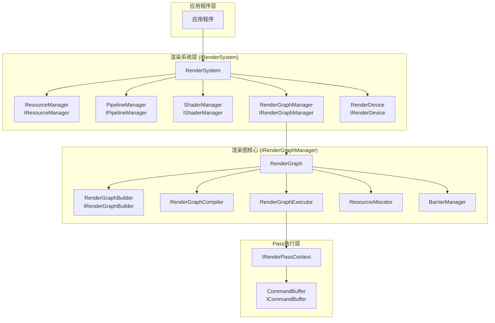
```mermaid
graph TB
    subgraph Application["应用程序层"]
        App[应用程序]
    end

    subgraph RenderSystem["渲染系统层 (IRenderSystem)"]
        RS[RenderSystem]
        RM[ResourceManager<br>IResourceManager]
        PM[PipelineManager<br>IPipelineManager]
        SM[ShaderManager<br>IShaderManager]
        RGM[RenderGraphManager<br>IRenderGraphManager]
        RD[RenderDevice<br>IRenderDevice]
    end

    subgraph RenderGraph["渲染图核心 (IRenderGraphManager)"]
        RG[RenderGraph]
        RGB[RenderGraphBuilder<br>IRenderGraphBuilder]
        RGC[RenderGraphCompiler]
        RGE[RenderGraphExecutor]
        RA[ResourceAllocator]
        BM[BarrierManager]
    end

    subgraph PassExecution["Pass执行层"]
        RPC[IRenderPassContext]
        CBB[CommandBuffer<br>ICommandBuffer]
    end

    App --> RS
    RS --> RM
    RS --> PM
    RS --> SM
    RS --> RGM
    RS --> RD
    RGM --> RG
    RG --> RGB
    RG --> RGC
    RG --> RGE
    RG --> RA
    RG --> BM
    RGE --> RPC
    RPC --> CBB
```

---

## 二、编写 Pass 完整流程

### 2.1 Pass 创建流程图

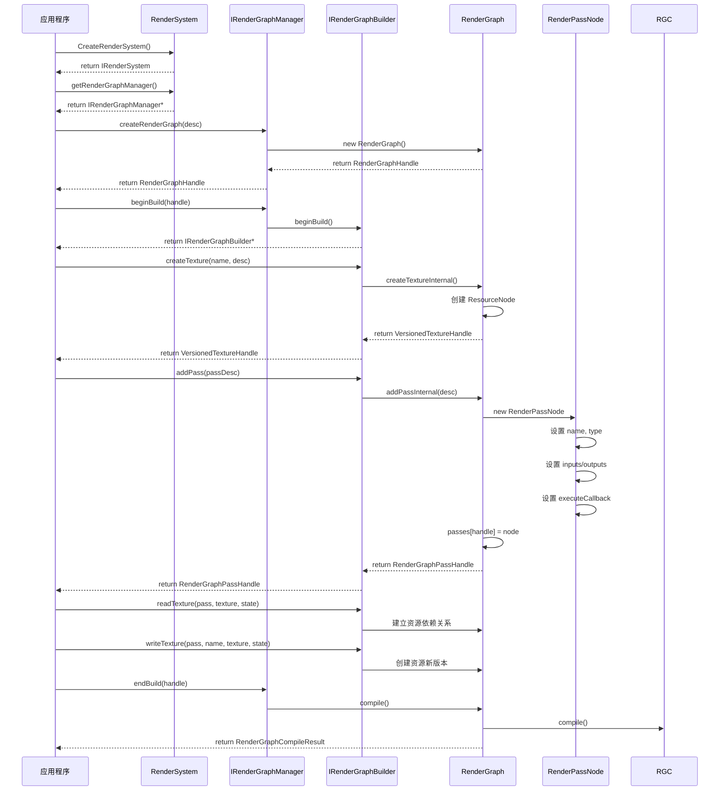
```mermaid
sequenceDiagram
    participant App as 应用程序
    participant RS as RenderSystem
    participant RGM as IRenderGraphManager
    participant RGB as IRenderGraphBuilder
    participant RG as RenderGraph
    participant Pass as RenderPassNode

    App->>RS: CreateRenderSystem()
    RS-->>App: return IRenderSystem

    App->>RS: getRenderGraphManager()
    RS-->>App: return IRenderGraphManager*

    App->>RGM: createRenderGraph(desc)
    RGM->>RG: new RenderGraph()
    RG-->>RGM: return RenderGraphHandle
    RGM-->>App: return RenderGraphHandle

    App->>RGM: beginBuild(handle)
    RGM->>RGB: beginBuild()
    RGB-->>App: return IRenderGraphBuilder*

    App->>RGB: createTexture(name, desc)
    RGB->>RG: createTextureInternal()
    RG->>RG: 创建 ResourceNode
    RG-->>RGB: return VersionedTextureHandle
    RGB-->>App: return VersionedTextureHandle

    App->>RGB: addPass(passDesc)
    RGB->>RG: addPassInternal(desc)
    RG->>Pass: new RenderPassNode
    Pass->>Pass: 设置 name, type
    Pass->>Pass: 设置 inputs/outputs
    Pass->>Pass: 设置 executeCallback
    RG->>RG: passes[handle] = node
    RG-->>RGB: return RenderGraphPassHandle
    RGB-->>App: return RenderGraphPassHandle

    App->>RGB: readTexture(pass, texture, state)
    RGB->>RG: 建立资源依赖关系

    App->>RGB: writeTexture(pass, name, texture, state)
    RGB->>RG: 创建资源新版本

    App->>RGM: endBuild(handle)
    RGM->>RG: compile()
    RG->>RGC: compile()
    RG-->>App: return RenderGraphCompileResult
```

### 2.2 Pass 创建代码示例

```cpp
// 1. 创建渲染系统
auto renderSystem = render::CreateRenderSystem(render::RenderAPI::Vulkan);
renderSystem->initialize(config);

// 2. 获取管理器
auto* rgm = renderSystem->getRenderGraphManager();
auto* resourceManager = renderSystem->getResourceManager();
auto* pipelineManager = renderSystem->getPipelineManager();

// 3. 创建渲染图
render::RenderGraphDesc graphDesc;
graphDesc.name = "MainRenderGraph";
graphDesc.flags = render::RenderGraphFlags::EnableResourceAliasing |
                  render::RenderGraphFlags::EnableBarrierBatching;
graphDesc.maxPasses = 128;
graphDesc.maxResources = 256;

render::RenderGraphHandle graph = rgm->createRenderGraph(graphDesc);

// 4. 开始构建
render::IRenderGraphBuilder* builder = rgm->beginBuild(graph);

// 5. 声明资源
render::RenderGraphResourceDesc colorDesc;
colorDesc.name = "ColorBuffer";
colorDesc.type = render::ResourceType::Texture2D;
colorDesc.format = render::Format::RGBA8_UNORM;
colorDesc.extent = {1280, 720, 1};
colorDesc.usage = render::ResourceUsage::RenderTarget | render::ResourceUsage::ShaderResource;

render::VersionedTextureHandle colorBuffer = builder->createTexture("ColorBuffer", colorDesc);

// 6. 创建深度缓冲
render::RenderGraphResourceDesc depthDesc;
depthDesc.name = "DepthBuffer";
depthDesc.type = render::ResourceType::Texture2D;
depthDesc.format = render::Format::D24_UNORM_S8_UINT;
depthDesc.extent = {1280, 720, 1};
depthDesc.usage = render::ResourceUsage::DepthStencil;

render::VersionedTextureHandle depthBuffer = builder->createTexture("DepthBuffer", depthDesc);

// 7. 添加渲染通道
render::RenderPassDesc gbufferPassDesc;
gbufferPassDesc.name = "GBufferPass";
gbufferPassDesc.type = render::RenderPassType::Graphics;
gbufferPassDesc.colorTargets = {colorBuffer};
gbufferPassDesc.depthStencilTarget = depthBuffer;
gbufferPassDesc.clearColorEnabled = true;
gbufferPassDesc.clearColor = render::ClearValue(0.0f, 0.0f, 0.0f, 1.0f);
gbufferPassDesc.clearDepthEnabled = true;
gbufferPassDesc.clearDepthStencil = render::ClearValue::depthStencil(1.0f, 0);

// 设置执行回调
gbufferPassDesc.executeCallback = [](render::IRenderPassContext& context) {
    // 获取命令缓冲区
    render::ICommandBuffer* cmdBuffer = context.getCommandBuffer();
    
    // 设置管线和描述符集
    context.setPipeline(gbufferPipeline);
    context.setDescriptorSet(0, globalDescriptorSet);
    context.setDescriptorSet(1, materialDescriptorSet);
    
    // 设置视口和裁剪
    context.setViewport(render::Viewport(0, 0, 1280, 720));
    context.setScissor(render::Rect(0, 0, 1280, 720));
    
    // 绘制场景
    for (const auto& mesh : sceneMeshes) {
        context.setDescriptorSet(2, mesh.descriptorSet);
        context.drawIndexed(mesh.indexCount, 1, 0, 0, 0);
    }
};

render::RenderGraphPassHandle gbufferPass = builder->addPass(gbufferPassDesc);

// 8. 设置资源访问
builder->readTexture(gbufferPass, colorBuffer, render::ResourceState::RenderTarget);
builder->writeTexture(gbufferPass, "ColorBuffer", colorBuffer, render::ResourceState::RenderTarget);

// 9. 设置输出
builder->setOutput(colorBuffer);

// 10. 结束构建并编译
render::RenderGraphCompileResult compileResult = rgm->endBuild(graph);
```

---

## 三、RenderGraph 编译流程

### 3.1 编译流程图

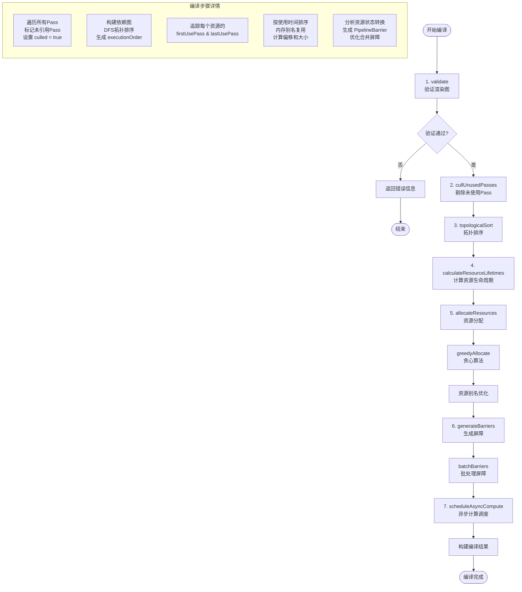
```mermaid
flowchart TB
    Start([开始编译]) --> Validate[1. validate<br>验证渲染图]
    Validate --> ValidateOK{验证通过?}
    ValidateOK -->|否| Error1[返回错误信息]
    Error1 --> End1([结束])
    
    ValidateOK -->|是| Cull[2. cullUnusedPasses<br>剔除未使用Pass]
    Cull --> Sort[3. topologicalSort<br>拓扑排序]
    Sort --> Lifetime[4. calculateResourceLifetimes<br>计算资源生命周期]
    
    Lifetime --> Allocate[5. allocateResources<br>资源分配]
    Allocate --> Greedy[greedyAllocate<br>贪心算法]
    Greedy --> Alias[资源别名优化]
    
    Alias --> Barrier[6. generateBarriers<br>生成屏障]
    Barrier --> Batch[batchBarriers<br>批处理屏障]
    
    Batch --> Async[7. scheduleAsyncCompute<br>异步计算调度]
    
    Async --> Result[构建编译结果]
    Result --> End2([编译完成])

    subgraph CompileSteps["编译步骤详情"]
        direction TB
        CullDetail["遍历所有Pass<br>标记未引用Pass<br>设置 culled = true"]
        SortDetail["构建依赖图<br>DFS拓扑排序<br>生成 executionOrder"]
        LifetimeDetail["追踪每个资源的<br>firstUsePass & lastUsePass"]
        AllocateDetail["按使用时间排序<br>内存别名复用<br>计算偏移和大小"]
        BarrierDetail["分析资源状态转换<br>生成 PipelineBarrier<br>优化合并屏障"]
    end
```

### 3.2 编译代码流程

```cpp
// RenderGraphCompiler::compile() 实现流程
class RenderGraphCompiler {
public:
    RenderGraphCompileResult compile() {
        RenderGraphCompileResult result;
        
        // 1. 验证
        if (!validate()) {
            result.success = false;
            result.errors.push_back("Validation failed");
            return result;
        }
        
        // 2. 剔除未使用的Pass
        cullUnusedPasses();
        
        // 3. 拓扑排序
        topologicalSort();
        
        // 4. 计算资源生命周期
        calculateResourceLifetimes();
        
        // 5. 资源分配
        resourceAllocations = resourceAllocator->allocate(
            getActiveResourceNodes());
        
        // 6. 生成屏障
        barriers = barrierManager->generateBarriers(executionOrder);
        barrierManager->batchBarriers(barriers);
        
        // 7. 异步计算调度
        scheduleAsyncCompute();
        
        // 构建结果
        result.success = true;
        result.executionOrder = executionOrder;
        result.totalMemory = calculateTotalMemory();
        result.peakMemory = calculatePeakMemory();
        result.aliasedResourceCount = calculateAliasedCount();
        result.estimatedPasses = executionOrder.size();
        result.estimatedBarriers = barriers.size();
        
        return result;
    }
    
private:
    bool validate() {
        // 检查所有输入资源是否已声明
        // 检查渲染目标配置
        // 检查依赖关系环
        return true;
    }
    
    void cullUnusedPasses() {
        // 从输出资源反向遍历
        // 标记所有可达Pass
        // 未标记的Pass设置 culled = true
    }
    
    void topologicalSort() {
        // 构建邻接表
        std::unordered_map<RenderGraphPassHandle, std::vector<RenderGraphPassHandle>> adjacency;
        
        for (const auto& [handle, pass] : passes) {
            if (pass->culled) continue;
            
            for (const auto& input : pass->inputs) {
                // 找到生产这个资源的Pass
                auto producer = findResourceProducer(input.handle);
                if (producer.isValid()) {
                    adjacency[producer].push_back(handle);
                    pass->dependencies.push_back(producer);
                }
            }
        }
        
        // DFS拓扑排序
        std::set<RenderGraphPassHandle> visited;
        std::vector<RenderGraphPassHandle> sorted;
        
        std::function<void(RenderGraphPassHandle)> dfs = [&](RenderGraphPassHandle h) {
            if (visited.count(h)) return;
            visited.insert(h);
            
            for (auto next : adjacency[h]) {
                dfs(next);
            }
            sorted.push_back(h);
        };
        
        for (const auto& [handle, pass] : passes) {
            if (!pass->culled && pass->dependencies.empty()) {
                dfs(handle);
            }
        }
        
        executionOrder = std::move(sorted);
        
        // 设置执行顺序
        for (u32 i = 0; i < executionOrder.size(); ++i) {
            getPassNode(executionOrder[i])->executionOrder = i;
        }
    }
    
    void calculateResourceLifetimes() {
        for (auto& [handle, resource] : resources) {
            resource->firstUsePass = ~0u;
            resource->lastUsePass = 0;
            
            for (u32 i = 0; i < executionOrder.size(); ++i) {
                auto* pass = getPassNode(executionOrder[i]);
                
                // 检查资源是否在此Pass中使用
                bool used = false;
                for (const auto& input : pass->inputs) {
                    if (input.handle.getIndex() == handle) {
                        used = true;
                        break;
                    }
                }
                for (const auto& output : pass->outputs) {
                    if (output.handle.getIndex() == handle) {
                        used = true;
                        break;
                    }
                }
                
                if (used) {
                    if (resource->firstUsePass == ~0u) {
                        resource->firstUsePass = i;
                    }
                    resource->lastUsePass = i;
                }
            }
        }
    }
};
```

---

## 四、RenderGraph 执行流程

### 4.1 执行流程图

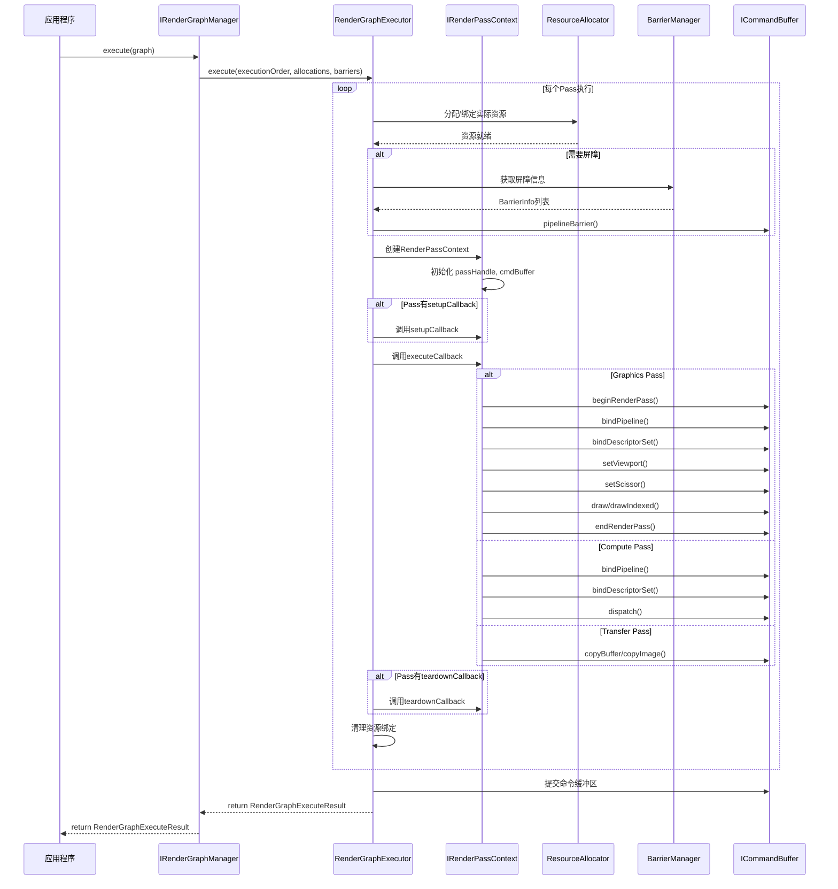
```mermaid
sequenceDiagram
    participant App as 应用程序
    participant RGM as IRenderGraphManager
    participant RGE as RenderGraphExecutor
    participant RPC as IRenderPassContext
    participant Res as ResourceAllocator
    participant BM as BarrierManager
    participant Cmd as ICommandBuffer

    App->>RGM: execute(graph)
    RGM->>RGE: execute(executionOrder, allocations, barriers)

    loop 每个Pass执行
        RGE->>Res: 分配/绑定实际资源
        Res-->>RGE: 资源就绪

        alt 需要屏障
            RGE->>BM: 获取屏障信息
            BM-->>RGE: BarrierInfo列表
            RGE->>Cmd: pipelineBarrier()
        end

        RGE->>RPC: 创建RenderPassContext
        RPC->>RPC: 初始化 passHandle, cmdBuffer

        alt Pass有setupCallback
            RGE->>RPC: 调用setupCallback
        end

        RGE->>RPC: 调用executeCallback

        alt Graphics Pass
            RPC->>Cmd: beginRenderPass()
            RPC->>Cmd: bindPipeline()
            RPC->>Cmd: bindDescriptorSet()
            RPC->>Cmd: setViewport()
            RPC->>Cmd: setScissor()
            RPC->>Cmd: draw/drawIndexed()
            RPC->>Cmd: endRenderPass()
        else Compute Pass
            RPC->>Cmd: bindPipeline()
            RPC->>Cmd: bindDescriptorSet()
            RPC->>Cmd: dispatch()
        else Transfer Pass
            RPC->>Cmd: copyBuffer/copyImage()
        end

        alt Pass有teardownCallback
            RGE->>RPC: 调用teardownCallback
        end

        RGE->>RGE: 清理资源绑定
    end

    RGE->>Cmd: 提交命令缓冲区
    RGE-->>RGM: return RenderGraphExecuteResult
    RGM-->>App: return RenderGraphExecuteResult
```

### 4.2 执行代码流程

```cpp
// RenderGraphExecutor::execute() 实现
RenderGraphExecuteResult RenderGraphExecutor::execute(
    const std::vector<RenderGraphPassHandle>& executionOrder,
    const std::vector<ResourceAllocation>& allocations,
    const std::vector<BarrierInfo>& barriers) {
    
    RenderGraphExecuteResult result;
    result.success = true;
    
    // 创建主命令缓冲区
    ICommandBuffer* cmdBuffer = createCommandBuffer();
    cmdBuffer->begin();
    
    // 执行屏障（初始状态转换）
    applyInitialBarriers(cmdBuffer, barriers);
    
    // 按顺序执行每个Pass
    for (u32 passIndex = 0; passIndex < executionOrder.size(); ++passIndex) {
        RenderGraphPassHandle passHandle = executionOrder[passIndex];
        RenderPassNode* passNode = getPassNode(passHandle);
        
        if (passNode->culled) continue;
        
        // 执行Pass前的屏障
        applyPassBarriers(cmdBuffer, passIndex, barriers);
        
        // 创建执行上下文
        RenderPassContext context(
            passHandle,
            passNode->name.c_str(),
            passNode->type,
            cmdBuffer,
            resourceManager,
            pipelineManager
        );
        
        // 绑定资源到上下文
        bindResourcesToContext(&context, passNode, allocations);
        
        // 开始调试标记
        cmdBuffer->beginDebugMarker(passNode->name.c_str(), Color(1.0f, 1.0f, 0.0f, 1.0f));
        
        // Setup回调
        if (passNode->setupCallback) {
            passNode->setupCallback(context);
        }
        
        // 执行回调（用户渲染代码）
        if (passNode->executeCallback) {
            passNode->executeCallback(context);
        }
        
        // Teardown回调
        if (passNode->teardownCallback) {
            passNode->teardownCallback(context);
        }
        
        // 结束调试标记
        cmdBuffer->endDebugMarker();
        
        result.executedPasses++;
    }
    
    // 结束命令录制
    cmdBuffer->end();
    
    // 提交到队列
    submitCommandBuffer(cmdBuffer);
    
    return result;
}

// RenderPassContext 实现示例
class RenderPassContext : public IRenderPassContext {
public:
    RenderPassContext(
        RenderGraphPassHandle pass,
        const char* name,
        RenderPassType type,
        ICommandBuffer* cmdBuffer,
        IResourceManager* resMgr,
        IPipelineManager* pipeMgr)
        : passHandle(pass)
        , passName(name)
        , passType(type)
        , commandBuffer(cmdBuffer)
        , resourceManager(resMgr)
        , pipelineManager(pipeMgr) {}

    // IRenderPassContext 实现
    RenderGraphPassHandle getCurrentPass() const override { return passHandle; }
    const char* getPassName() const override { return passName; }
    RenderPassType getPassType() const override { return passType; }
    ICommandBuffer* getCommandBuffer() override { return commandBuffer; }

    void setPipeline(PipelineHandle pipeline) override {
        commandBuffer->bindPipeline(pipeline);
    }

    void setDescriptorSet(u32 setIndex, DescriptorSetHandle descriptorSet) override {
        commandBuffer->bindDescriptorSet(setIndex, descriptorSet);
    }

    void setPushConstants(ShaderStage stages, u32 offset, u32 size, const void* data) override {
        // 获取当前管线布局并推送常量
        commandBuffer->pushConstants(currentPipelineLayout, stages, offset, size, data);
    }

    void draw(u32 vertexCount, u32 instanceCount,
              u32 firstVertex, u32 firstInstance) override {
        commandBuffer->draw(vertexCount, instanceCount, firstVertex, firstInstance);
    }

    void drawIndexed(u32 indexCount, u32 instanceCount,
                     u32 firstIndex, i32 vertexOffset, u32 firstInstance) override {
        commandBuffer->drawIndexed(indexCount, instanceCount, firstIndex, 
                                   vertexOffset, firstInstance);
    }

    void dispatch(u32 groupCountX, u32 groupCountY, u32 groupCountZ) override {
        commandBuffer->dispatch(groupCountX, groupCountY, groupCountZ);
    }

    void resourceBarrier(TextureHandle texture, ResourceState newState,
                        const SubresourceRange& range) override {
        // 自动推断旧状态
        ResourceState oldState = getCurrentState(texture);
        
        commandBuffer->imageMemoryBarrier(
            texture,
            convertToImageLayout(oldState),
            convertToImageLayout(newState),
            inferSourceStage(oldState),
            inferDestStage(newState),
            inferSourceAccess(oldState),
            inferDestAccess(newState),
            range
        );
    }

    void beginDebugMarker(const char* name, const Color& color) override {
        commandBuffer->beginDebugMarker(name, color);
    }

    void endDebugMarker() override {
        commandBuffer->endDebugMarker();
    }

private:
    RenderGraphPassHandle passHandle;
    const char* passName;
    RenderPassType passType;
    ICommandBuffer* commandBuffer;
    IResourceManager* resourceManager;
    IPipelineManager* pipelineManager;
    PipelineLayoutHandle currentPipelineLayout;
};
```

---

## 五、完整调用链

### 5.1 主循环调用链

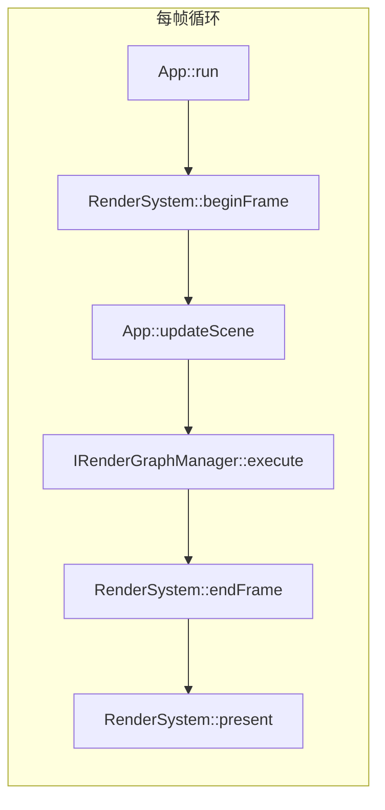
```mermaid
flowchart LR
    subgraph FrameLoop["每帧循环"]
        A[App::run] --> B[RenderSystem::beginFrame]
        B --> C[App::updateScene]
        C --> D[IRenderGraphManager::execute]
        D --> E[RenderSystem::endFrame]
        E --> F[RenderSystem::present]
    end
```

### 5.2 详细函数调用链

```
应用程序主循环
│
├─► RenderSystem::beginFrame(const FrameInfo& frameInfo)
│   ├─► 更新帧号: frameNumber++
│   ├─► 等待前一帧完成
│   └─► 获取下一交换链图像
│
├─► 更新场景数据
│   ├─► 更新Uniform Buffer
│   ├─► 上传顶点/索引数据
│   └─► 更新纹理资源
│
├─► IRenderGraphManager::execute(RenderGraphHandle handle)
│   └─► RenderGraph::execute(handle)
│       └─► RenderGraphExecutor::execute(...)
│           ├─► 创建/重置命令缓冲区: ICommandBuffer::begin()
│           │
│           ├─► 遍历 executionOrder 中的每个 Pass
│           │   ├─► 应用资源屏障: BarrierManager::generateBarriers()
│           │   │   └─► ICommandBuffer::pipelineBarrier()
│           │   │
│           │   ├─► 创建 RenderPassContext
│           │   │   └─► new RenderPassContext(pass, cmdBuffer, ...)
│           │   │
│           │   ├─► 调用 Pass::setupCallback(context) [可选]
│           │   │
│           │   ├─► 调用 Pass::executeCallback(context)
│           │   │   ├─► IRenderPassContext::setPipeline(pipeline)
│           │   │   │   └─► ICommandBuffer::bindPipeline(pipeline)
│           │   │   │
│           │   │   ├─► IRenderPassContext::setDescriptorSet(index, set)
│           │   │   │   └─► ICommandBuffer::bindDescriptorSet(index, set)
│           │   │   │
│           │   │   ├─► IRenderPassContext::setViewport(viewport)
│           │   │   │   └─► ICommandBuffer::setViewport(viewport)
│           │   │   │
│           │   │   ├─► IRenderPassContext::setScissor(scissor)
│           │   │   │   └─► ICommandBuffer::setScissor(scissor)
│           │   │   │
│           │   │   ├─► IRenderPassContext::drawIndexed(count, ...)
│           │   │   │   └─► ICommandBuffer::drawIndexed(count, ...)
│           │   │   │       └─► vkCmdDrawIndexed [Vulkan实现]
│           │   │   │
│           │   │   └─► IRenderPassContext::dispatch(x, y, z) [计算Pass]
│           │   │       └─► ICommandBuffer::dispatch(x, y, z)
│           │   │           └─► vkCmdDispatch [Vulkan实现]
│           │   │
│           │   ├─► 调用 Pass::teardownCallback(context) [可选]
│           │   │
│           │   └─► 插入调试标记: ICommandBuffer::endDebugMarker()
│           │
│           ├─► 结束命令录制: ICommandBuffer::end()
│           │
│           └─► 提交命令缓冲区到队列
│               └─► ICommandQueue::submit(cmdBuffer, ...)
│                   └─► vkQueueSubmit [Vulkan实现]
│
├─► RenderSystem::endFrame()
│   ├─► 信号量同步
│   └─► 释放临时资源
│
└─► RenderSystem::present(swapChain)
    └─► 呈现到屏幕
        └─► vkQueuePresentKHR [Vulkan实现]
```

---

## 六、关键数据结构关系

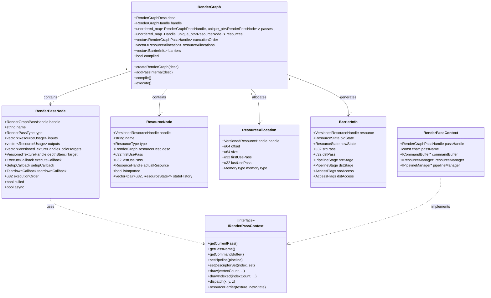
```mermaid
classDiagram
    class RenderGraph {
        +RenderGraphDesc desc
        +RenderGraphHandle handle
        +unordered_map~RenderGraphPassHandle, unique_ptr~RenderPassNode~~ passes
        +unordered_map~Handle, unique_ptr~ResourceNode~~ resources
        +vector~RenderGraphPassHandle~ executionOrder
        +vector~ResourceAllocation~ resourceAllocations
        +vector~BarrierInfo~ barriers
        +bool compiled
        +createRenderGraph(desc)
        +addPassInternal(desc)
        +compile()
        +execute()
    }

    class RenderPassNode {
        +RenderGraphPassHandle handle
        +string name
        +RenderPassType type
        +vector~ResourceUsage~ inputs
        +vector~ResourceUsage~ outputs
        +vector~VersionedTextureHandle~ colorTargets
        +VersionedTextureHandle depthStencilTarget
        +ExecuteCallback executeCallback
        +SetupCallback setupCallback
        +TeardownCallback teardownCallback
        +u32 executionOrder
        +bool culled
        +bool async
    }

    class ResourceNode {
        +VersionedResourceHandle handle
        +string name
        +ResourceType type
        +RenderGraphResourceDesc desc
        +u32 firstUsePass
        +u32 lastUsePass
        +ResourceHandle actualResource
        +bool isImported
        +vector~pair~u32, ResourceState~~ stateHistory
    }

    class ResourceAllocation {
        +VersionedResourceHandle handle
        +u64 offset
        +u64 size
        +u32 firstUsePass
        +u32 lastUsePass
        +MemoryType memoryType
    }

    class BarrierInfo {
        +VersionedResourceHandle resource
        +ResourceState oldState
        +ResourceState newState
        +u32 srcPass
        +u32 dstPass
        +PipelineStage srcStage
        +PipelineStage dstStage
        +AccessFlags srcAccess
        +AccessFlags dstAccess
    }

    class IRenderPassContext {
        <<interface>>
        +getCurrentPass()
        +getPassName()
        +getCommandBuffer()
        +setPipeline(pipeline)
        +setDescriptorSet(index, set)
        +draw(vertexCount, ...)
        +drawIndexed(indexCount, ...)
        +dispatch(x, y, z)
        +resourceBarrier(texture, newState)
    }

    class RenderPassContext {
        +RenderGraphPassHandle passHandle
        +const char* passName
        +ICommandBuffer* commandBuffer
        +IResourceManager* resourceManager
        +IPipelineManager* pipelineManager
    }

    RenderGraph "1" --> "*" RenderPassNode : contains
    RenderGraph "1" --> "*" ResourceNode : contains
    RenderGraph "1" --> "*" ResourceAllocation : allocates
    RenderGraph "1" --> "*" BarrierInfo : generates
    RenderPassNode ..> IRenderPassContext : uses
    RenderPassContext ..|> IRenderPassContext : implements
```

---

## 七、资源别名与内存管理

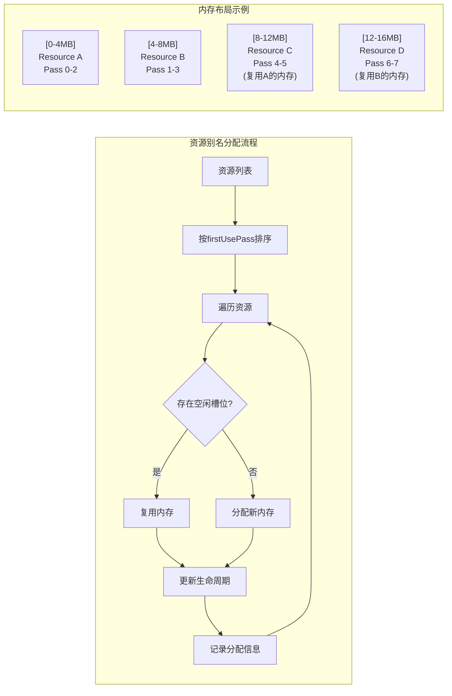
```mermaid
flowchart LR
    subgraph ResourceAliasing["资源别名分配流程"]
        A[资源列表] --> B[按firstUsePass排序]
        B --> C[遍历资源]
        C --> D{存在空闲槽位?}
        D -->|是| E[复用内存]
        D -->|否| F[分配新内存]
        E --> G[更新生命周期]
        F --> G
        G --> H[记录分配信息]
        H --> C
    end

    subgraph MemoryLayout["内存布局示例"]
        direction TB
        M1["[0-4MB]<br>Resource A<br>Pass 0-2"]
        M2["[4-8MB]<br>Resource B<br>Pass 1-3"]
        M3["[8-12MB]<br>Resource C<br>Pass 4-5<br>(复用A的内存)"]
        M4["[12-16MB]<br>Resource D<br>Pass 6-7<br>(复用B的内存)"]
    end
```

---

## 八、屏障生成与优化

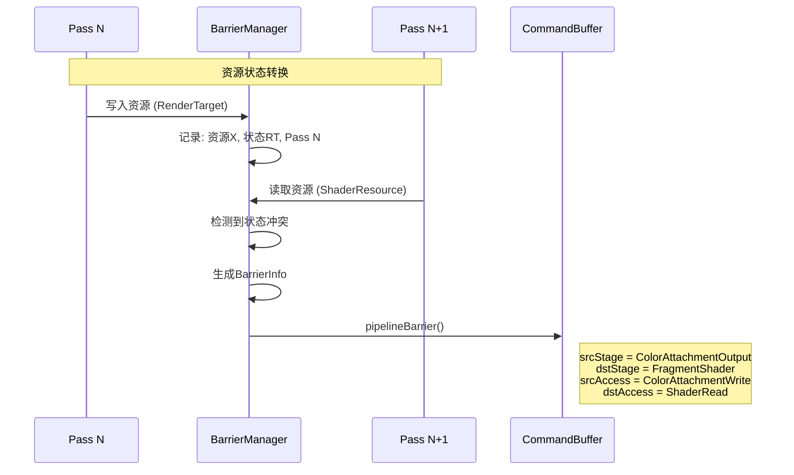
```mermaid
sequenceDiagram
    participant Pass1 as Pass N
    participant Barrier as BarrierManager
    participant Pass2 as Pass N+1
    participant Cmd as CommandBuffer

    Note over Pass1,Pass2: 资源状态转换

    Pass1->>Barrier: 写入资源 (RenderTarget)
    Barrier->>Barrier: 记录: 资源X, 状态RT, Pass N

    Pass2->>Barrier: 读取资源 (ShaderResource)
    Barrier->>Barrier: 检测到状态冲突
    Barrier->>Barrier: 生成BarrierInfo

    Barrier->>Cmd: pipelineBarrier()
    Note right of Cmd: srcStage = ColorAttachmentOutput<br>dstStage = FragmentShader<br>srcAccess = ColorAttachmentWrite<br>dstAccess = ShaderRead
```

---

## 九、完整的 Pass 编写模板

```cpp
// 完整的 Pass 编写示例
void createMyRenderGraph(IRenderGraphManager* rgm) {
    // 1. 创建渲染图
    RenderGraphDesc desc;
    desc.name = "MyRenderGraph";
    desc.flags = RenderGraphFlags::EnableResourceAliasing | 
                 RenderGraphFlags::EnableBarrierBatching;
    
    RenderGraphHandle graph = rgm->createRenderGraph(desc);
    
    // 2. 开始构建
    IRenderGraphBuilder* builder = rgm->beginBuild(graph);
    
    // 3. 声明资源
    RenderGraphResourceDesc gbufferDesc;
    gbufferDesc.name = "GBuffer";
    gbufferDesc.type = ResourceType::Texture2D;
    gbufferDesc.format = Format::RGBA16_FLOAT;
    gbufferDesc.extent = {1920, 1080, 1};
    gbufferDesc.usage = ResourceUsage::RenderTarget | ResourceUsage::ShaderResource;
    
    auto gbuffer = builder->createTexture("GBuffer", gbufferDesc);
    
    // 4. 添加 GBuffer Pass
    RenderPassDesc gbufferPass;
    gbufferPass.name = "GBufferPass";
    gbufferPass.type = RenderPassType::Graphics;
    gbufferPass.colorTargets = {gbuffer};
    gbufferPass.clearColorEnabled = true;
    gbufferPass.clearColor = ClearValue(0.0f, 0.0f, 0.0f, 0.0f);
    
    gbufferPass.executeCallback = [](IRenderPassContext& ctx) {
        // 获取实际资源句柄
        TextureHandle texture = ctx.getTexture(gbuffer);
        
        // 设置渲染状态
        ctx.setPipeline(gbufferPipeline);
        ctx.setDescriptorSet(0, sceneDescriptorSet);
        
        // 设置视口
        ctx.setViewport(Viewport(0, 0, 1920, 1080));
        ctx.setScissor(Rect(0, 0, 1920, 1080));
        
        // 绘制
        for (const auto& obj : renderObjects) {
            ctx.setDescriptorSet(1, obj.materialSet);
            ctx.drawIndexed(obj.indexCount, 1, obj.indexOffset, 0, 0);
        }
        
        // 调试标记
        ctx.insertDebugMarker("GBuffer Pass Complete", Color(0, 1, 0, 1));
    };
    
    auto gbufferPassHandle = builder->addPass(gbufferPass);
    builder->writeTexture(gbufferPassHandle, "GBuffer", gbuffer, ResourceState::RenderTarget);
    
    // 5. 添加 Lighting Pass
    RenderPassDesc lightingPass;
    lightingPass.name = "LightingPass";
    lightingPass.type = RenderPassType::Graphics;
    
    lightingPass.executeCallback = [](IRenderPassContext& ctx) {
        ctx.setPipeline(lightingPipeline);
        ctx.setDescriptorSet(0, lightingDescriptorSet);
        
        // 读取 GBuffer
        auto gbufferView = ctx.getTextureView(gbuffer);
        ctx.setDescriptorSet(1, gbufferView);
        
        // 全屏四边形绘制
        ctx.draw(3, 1, 0, 0); // 三角形覆盖全屏
    };
    
    auto lightingPassHandle = builder->addPass(lightingPass);
    builder->readTexture(lightingPassHandle, gbuffer, ResourceState::ShaderResource);
    
    // 6. 设置输出
    builder->setOutput(gbuffer);
    
    // 7. 编译
    auto result = rgm->endBuild(graph);
    
    if (!result.success) {
        for (const auto& error : result.errors) {
            LOG_ERROR("Compile error: %s", error.c_str());
        }
    }
    
    // 8. 执行
    rgm->execute(graph);
}
```

---

## 十、多队列与异步计算支持

### 10.1 多队列架构流程图

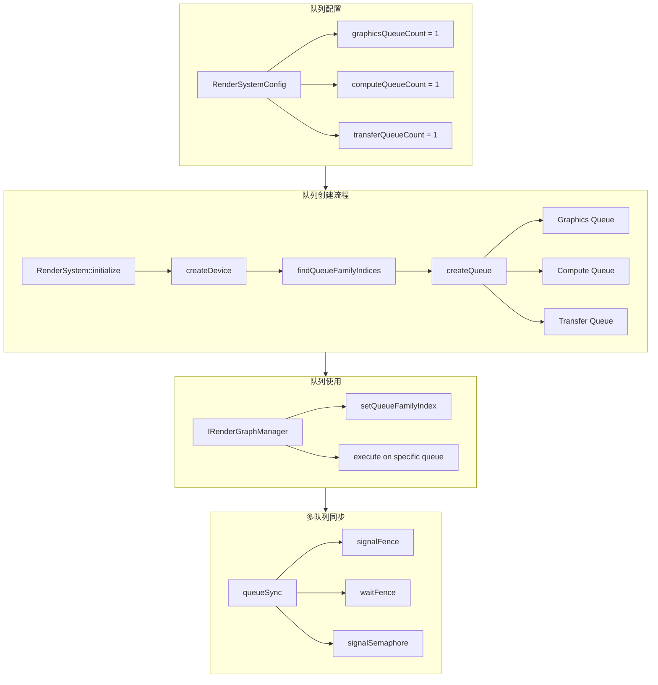
```mermaid
graph TB
    subgraph QueueConfig["队列配置"]
        QC[RenderSystemConfig]
        QC --> GQC[graphicsQueueCount = 1]
        QC --> CQC[computeQueueCount = 1]
        QC --> TQC[transferQueueCount = 1]
    end

    subgraph QueueCreation["队列创建流程"]
        RS[RenderSystem::initialize]
        RS --> CD[createDevice]
        CD --> FQFI[findQueueFamilyIndices]
        FQFI --> CQ[createQueue]
        CQ --> GQ[Graphics Queue]
        CQ --> CQ2[Compute Queue]
        CQ --> TQ[Transfer Queue]
    end

    subgraph QueueUsage["队列使用"]
        RGM[IRenderGraphManager]
        RGM --> SQFI[setQueueFamilyIndex]
        RGM --> EQ[execute on specific queue]
    end

    subgraph MultiQueueSync["多队列同步"]
        QS[queueSync]
        QS --> SF[signalFence]
        QS --> WF[waitFence]
        QS --> SS[signalSemaphore]
    end

    QueueConfig --> QueueCreation
    QueueCreation --> QueueUsage
    QueueUsage --> MultiQueueSync
```

### 10.2 异步计算 Pass 编写示例

```cpp
// 1. 配置异步计算队列
RenderSystemConfig config;
config.computeQueueCount = 1;  // 启用计算队列
renderSystem->initialize(config);

// 2. 获取队列族索引并配置RenderGraph
auto* rgm = renderSystem->getRenderGraphManager();
rgm->setQueueFamilyIndex(QueueType::Compute, 
    renderSystem->getComputeQueueFamilyIndex());

// 3. 创建异步计算Pass
RenderPassDesc particleComputeDesc;
particleComputeDesc.name = "ParticleCompute";
particleComputeDesc.type = RenderPassType::Compute;
particleComputeDesc.queueType = QueueType::Compute;  // 指定计算队列
particleComputeDesc.asyncCompute = true;              // 标记异步

particleComputeDesc.executeCallback = [](IRenderPassContext& ctx) {
    ctx.setPipeline(particlePipeline);
    ctx.setDescriptorSet(0, particleDataSet);
    ctx.dispatch(256, 1, 1);  // 计算着色器分发
};

auto computePass = builder->addPass(particleComputeDesc);

// 4. 添加队列同步点
builder->queueSync(computePass, QueueType::Compute, QueueType::Graphics);

// 5. 后续图形Pass可以安全使用计算结果
RenderPassDesc renderPassDesc;
renderPassDesc.name = "RenderParticles";
renderPassDesc.type = RenderPassType::Graphics;
// ... 可以读取粒子计算结果
```

### 10.3 队列同步机制

```cpp
// RenderGraph 内部队列同步实现
class RenderGraph {
private:
    void insertQueueSyncBarrier(const QueueSyncPoint& syncPoint, u32 passIndex) {
        // 1. 在源队列信号 Fence
        // 2. 在目标队列等待 Fence
        // 3. 可能涉及资源所有权转移
        
        BarrierInfo barrier;
        barrier.isQueueTransfer = true;
        barrier.srcQueue = syncPoint.srcQueue;
        barrier.dstQueue = syncPoint.dstQueue;
        barrier.srcPass = passIndex;
        barrier.dstPass = passIndex + 1;
        
        barriers.push_back(barrier);
    }
    
    void buildQueueDependencyGraph() {
        // 构建跨队列的依赖图
        // 确定哪些Pass可以在不同队列并行执行
        // 最小化同步点数量
    }
};
```

---

## 十一、Split Barrier 支持

### 11.1 Split Barrier 原理

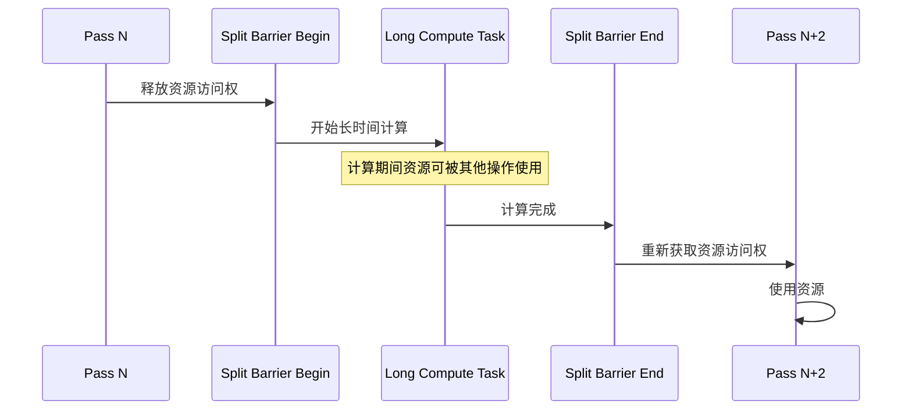
```mermaid
sequenceDiagram
    participant Pass1 as Pass N
    participant BarrierBegin as Split Barrier Begin
    participant Compute as Long Compute Task
    participant BarrierEnd as Split Barrier End
    participant Pass2 as Pass N+2

    Pass1->>BarrierBegin: 释放资源访问权
    BarrierBegin->>Compute: 开始长时间计算
    Note over Compute: 计算期间资源可被其他操作使用
    Compute->>BarrierEnd: 计算完成
    BarrierEnd->>Pass2: 重新获取资源访问权
    Pass2->>Pass2: 使用资源
```

### 11.2 Split Barrier 代码示例

```cpp
// 1. 启用Split Barrier
rgm->enableSplitBarriers(true);

// 2. 在Pass中使用Split Barrier
RenderPassDesc longComputeDesc;
longComputeDesc.name = "LongCompute";
longComputeDesc.type = RenderPassType::Compute;

longComputeDesc.setupCallback = [](IRenderPassContext& ctx) {
    // 开始Split Barrier - 释放资源让其他队列使用
    std::vector<ResourceBarrier> beginBarriers = {
        ResourceBarrier::image(gbufferTexture,
            ImageLayout::ColorAttachment, ImageLayout::ShaderReadOnly,
            PipelineStage::ColorAttachmentOutput, PipelineStage::TopOfPipe,
            AccessFlags::ColorAttachmentWrite, AccessFlags::None)
    };
    
    ctx.getCommandBuffer()->beginSplitBarrier(
        beginBarriers, 
        PipelineStage::ColorAttachmentOutput
    );
};

longComputeDesc.executeCallback = [](IRenderPassContext& ctx) {
    // 执行长时间计算
    ctx.setPipeline(heavyComputePipeline);
    ctx.dispatch(1024, 1024, 1);
};

longComputeDesc.teardownCallback = [](IRenderPassContext& ctx) {
    // 结束Split Barrier - 重新获取资源
    std::vector<ResourceBarrier> endBarriers = {
        ResourceBarrier::image(gbufferTexture,
            ImageLayout::ShaderReadOnly, ImageLayout::ColorAttachment,
            PipelineStage::BottomOfPipe, PipelineStage::FragmentShader,
            AccessFlags::None, AccessFlags::ShaderRead)
    };
    
    ctx.getCommandBuffer()->endSplitBarrier(
        endBarriers,
        PipelineStage::FragmentShader
    );
};
```

### 11.3 编译时Split Barrier优化

```cpp
class BarrierManager {
public:
    std::vector<BarrierInfo> generateBarriers(
        const std::vector<RenderGraphPassHandle>& executionOrder) {
        
        std::vector<BarrierInfo> barriers;
        
        for (u32 i = 0; i < executionOrder.size(); ++i) {
            auto* pass = getPassNode(executionOrder[i]);
            
            // 检测是否可以使用Split Barrier
            if (canUseSplitBarrier(pass, i)) {
                BarrierInfo beginBarrier;
                beginBarrier.isSplitBarrier = true;
                beginBarrier.splitPhase = SplitBarrierPhase::Begin;
                beginBarrier.srcPass = i;
                beginBarrier.splitCompletionPass = findCompletionPass(i);
                barriers.push_back(beginBarrier);
                
                BarrierInfo endBarrier;
                endBarrier.isSplitBarrier = true;
                endBarrier.splitPhase = SplitBarrierPhase::End;
                endBarrier.srcPass = beginBarrier.splitCompletionPass;
                barriers.push_back(endBarrier);
            }
        }
        
        return barriers;
    }
    
private:
    bool canUseSplitBarrier(RenderPassNode* pass, u32 passIndex) {
        // 判断条件：
        // 1. Pass执行时间较长
        // 2. 资源在后续多个Pass中不被使用
        // 3. 有足够的时间间隙
        return pass->type == RenderPassType::Compute &&
               pass->asyncCompute &&
               getEstimatedDuration(pass) > threshold;
    }
};
```

---

## 十二、Subpass 合并优化

### 12.1 Subpass 合并流程

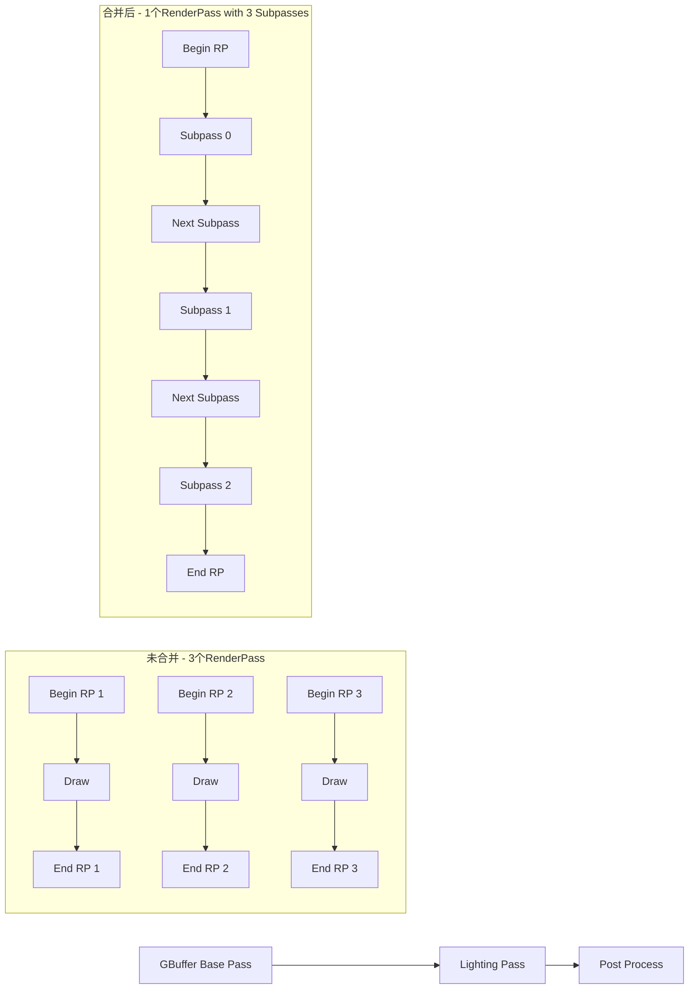
```mermaid
flowchart LR
    A[GBuffer Base Pass] --> B[Lighting Pass]
    B --> C[Post Process]
    
    subgraph WithoutMerging["未合并 - 3个RenderPass"]
        A1[Begin RP 1] --> A2[Draw] --> A3[End RP 1]
        B1[Begin RP 2] --> B2[Draw] --> B3[End RP 2]
        C1[Begin RP 3] --> C2[Draw] --> C3[End RP 3]
    end
    
    subgraph WithMerging["合并后 - 1个RenderPass with 3 Subpasses"]
        M1[Begin RP] --> M2[Subpass 0] --> M3[Next Subpass]
        M3 --> M4[Subpass 1] --> M5[Next Subpass]
        M5 --> M6[Subpass 2] --> M7[End RP]
    end
```

### 12.2 Subpass 合并代码示例

```cpp
// 1. 启用Subpass合并
rgm->enableSubpassMerging(true);

// 2. 开始Subpass分组
builder->beginSubpassGroup("DeferredShading");

// 3. 添加可合并的Pass
RenderPassDesc basePassDesc;
basePassDesc.name = "GBufferBase";
basePassDesc.type = RenderPassType::Graphics;
basePassDesc.colorTargets = {albedo, normal, depth};
basePassDesc.mergeWithNext = true;  // 标记可合并
basePassDesc.subpassIndex = 0;
auto basePass = builder->addPass(basePassDesc);

RenderPassDesc lightingPassDesc;
lightingPassDesc.name = "DeferredLighting";
lightingPassDesc.type = RenderPassType::Graphics;
lightingPassDesc.inputs = {albedo, normal};  // Input attachments
lightingPassDesc.colorTargets = {lighting};
lightingPassDesc.mergeWithNext = true;
lightingPassDesc.subpassIndex = 1;
auto lightingPass = builder->addPass(lightingPassDesc);

RenderPassDesc compositePassDesc;
compositePassDesc.name = "Composite";
compositePassDesc.type = RenderPassType::Graphics;
compositePassDesc.inputs = {lighting, depth};
compositePassDesc.colorTargets = {finalImage};
compositePassDesc.subpassIndex = 2;
auto compositePass = builder->addPass(compositePassDesc);

builder->endSubpassGroup();
```

### 12.3 Subpass 编译逻辑

```cpp
class RenderGraphCompiler {
private:
    void findMergeablePasses() {
        std::vector<std::vector<RenderGraphPassHandle>> groups;
        std::vector<RenderGraphPassHandle> currentGroup;
        
        for (auto passHandle : executionOrder) {
            auto* pass = getPassNode(passHandle);
            
            if (pass->mergeWithNext || !currentGroup.empty()) {
                currentGroup.push_back(passHandle);
                
                if (!pass->mergeWithNext) {
                    // 组结束
                    if (currentGroup.size() > 1) {
                        groups.push_back(currentGroup);
                        markAsSubpassGroup(currentGroup);
                    }
                    currentGroup.clear();
                }
            }
        }
    }
    
    void buildSubpassGroups() {
        for (const auto& group : subpassGroups) {
            RenderPassAttachmentDesc renderPassDesc;
            
            // 收集所有附件
            for (u32 i = 0; i < group.size(); ++i) {
                auto* pass = getPassNode(group[i]);
                
                SubpassDesc subpass;
                for (auto colorTarget : pass->colorTargets) {
                    subpass.colorAttachments.push_back(
                        getAttachmentIndex(colorTarget)
                    );
                }
                if (pass->depthStencilTarget.isValid()) {
                    subpass.depthStencilAttachment = 
                        getAttachmentIndex(pass->depthStencilTarget);
                }
                
                // 设置Input Attachments（读取前一Subpass的输出）
                for (const auto& input : pass->inputs) {
                    subpass.inputAttachments.push_back(
                        getAttachmentIndex(input.handle)
                    );
                }
                
                renderPassDesc.subpasses.push_back(subpass);
                pass->isSubpassMerged = true;
                pass->subpassIndex = i;
            }
            
            // 生成Subpass依赖
            for (u32 i = 1; i < group.size(); ++i) {
                SubpassDependency dep;
                dep.srcSubpass = i - 1;
                dep.dstSubpass = i;
                dep.srcStageMask = PipelineStage::ColorAttachmentOutput;
                dep.dstStageMask = PipelineStage::FragmentShader;
                dep.srcAccessMask = AccessFlags::ColorAttachmentWrite;
                dep.dstAccessMask = AccessFlags::InputAttachmentRead;
                dep.byRegion = true;  // TBR优化关键
                
                renderPassDesc.dependencies.push_back(dep);
            }
            
            mergedRenderPasses.push_back(renderPassDesc);
        }
    }
};
```

---

## 十三、后端图形API调用逻辑

### 13.1 Vulkan 后端调用链

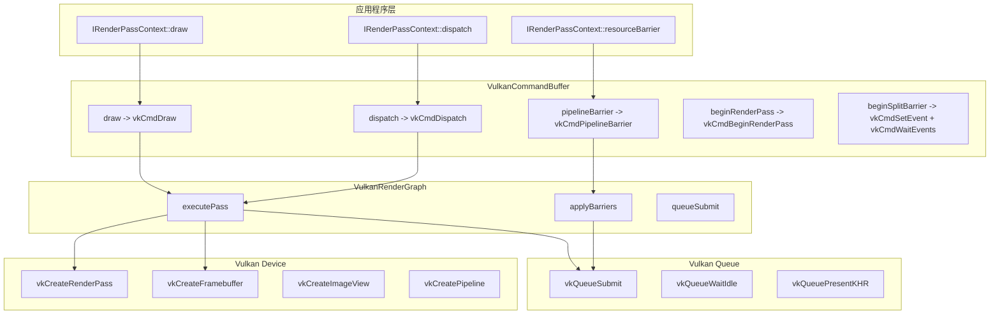
```mermaid
graph TD
    subgraph App["应用程序层"]
        A1[IRenderPassContext::draw]
        A2[IRenderPassContext::dispatch]
        A3[IRenderPassContext::resourceBarrier]
    end

    subgraph VulkanCommandBuffer["VulkanCommandBuffer"]
        V1[draw -> vkCmdDraw]
        V2[dispatch -> vkCmdDispatch]
        V3[pipelineBarrier -> vkCmdPipelineBarrier]
        V4[beginRenderPass -> vkCmdBeginRenderPass]
        V5[beginSplitBarrier -> vkCmdSetEvent + vkCmdWaitEvents]
    end

    subgraph VulkanRenderGraph["VulkanRenderGraph"]
        VR1[executePass]
        VR2[applyBarriers]
        VR3[queueSubmit]
    end

    subgraph VulkanQueue["Vulkan Queue"]
        Q1[vkQueueSubmit]
        Q2[vkQueueWaitIdle]
        Q3[vkQueuePresentKHR]
    end

    subgraph VulkanDevice["Vulkan Device"]
        D1[vkCreateRenderPass]
        D2[vkCreateFramebuffer]
        D3[vkCreateImageView]
        D4[vkCreatePipeline]
    end

    A1 --> V1
    A2 --> V2
    A3 --> V3
    V1 --> VR1
    V2 --> VR1
    V3 --> VR2
    VR1 --> Q1
    VR2 --> Q1
    VR1 --> D1
    VR1 --> D2
```

### 13.2 Vulkan 具体调用示例

```cpp
// VulkanCommandBuffer 实现示例
class VulkanCommandBuffer : public ICommandBuffer {
public:
    void draw(u32 vertexCount, u32 instanceCount,
              u32 firstVertex, u32 firstInstance) override {
        // 记录到Vulkan命令缓冲区
        vkCmdDraw(
            commandBuffer,
            vertexCount,
            instanceCount,
            firstVertex,
            firstInstance
        );
    }

    void dispatch(u32 groupCountX, u32 groupCountY, u32 groupCountZ) override {
        vkCmdDispatch(commandBuffer, groupCountX, groupCountY, groupCountZ);
    }

    void pipelineBarrier(PipelineStage srcStage, PipelineStage dstStage,
                        const std::vector<ResourceBarrier>& barriers) override {
        std::vector<VkImageMemoryBarrier> imageBarriers;
        std::vector<VkBufferMemoryBarrier> bufferBarriers;
        std::vector<VkMemoryBarrier> memoryBarriers;

        for (const auto& barrier : barriers) {
            switch (barrier.type) {
                case BarrierType::Image: {
                    VkImageMemoryBarrier vkBarrier = {};
                    vkBarrier.sType = VK_STRUCTURE_TYPE_IMAGE_MEMORY_BARRIER;
                    vkBarrier.srcAccessMask = convertAccessFlags(barrier.srcAccess);
                    vkBarrier.dstAccessMask = convertAccessFlags(barrier.dstAccess);
                    vkBarrier.oldLayout = convertImageLayout(barrier.oldLayout);
                    vkBarrier.newLayout = convertImageLayout(barrier.newLayout);
                    vkBarrier.srcQueueFamilyIndex = VK_QUEUE_FAMILY_IGNORED;
                    vkBarrier.dstQueueFamilyIndex = VK_QUEUE_FAMILY_IGNORED;
                    vkBarrier.image = getVulkanImage(barrier.texture);
                    vkBarrier.subresourceRange = convertSubresourceRange(
                        barrier.subresourceRange
                    );
                    imageBarriers.push_back(vkBarrier);
                    break;
                }
                case BarrierType::Aliasing: {
                    VkImageMemoryBarrier vkBarrier = {};
                    vkBarrier.sType = VK_STRUCTURE_TYPE_IMAGE_MEMORY_BARRIER;
                    vkBarrier.oldLayout = VK_IMAGE_LAYOUT_UNDEFINED;
                    vkBarrier.newLayout = VK_IMAGE_LAYOUT_GENERAL;
                    vkBarrier.image = getVulkanImage(barrier.texture);
                    imageBarriers.push_back(vkBarrier);
                    break;
                }
                // ... Buffer, Global barriers
            }
        }

        vkCmdPipelineBarrier(
            commandBuffer,
            convertPipelineStage(srcStage),
            convertPipelineStage(dstStage),
            0,  // dependencyFlags
            memoryBarriers.size(),
            memoryBarriers.data(),
            bufferBarriers.size(),
            bufferBarriers.data(),
            imageBarriers.size(),
            imageBarriers.data()
        );
    }

    void beginSplitBarrier(const std::vector<ResourceBarrier>& barriers,
                           PipelineStage srcStage) override {
        // Vulkan使用Event实现Split Barrier
        VkEventCreateInfo eventInfo = {};
        eventInfo.sType = VK_STRUCTURE_TYPE_EVENT_CREATE_INFO;
        vkCreateEvent(device, &eventInfo, nullptr, &splitEvent);

        // 设置Event - 标记资源已准备好被释放
        vkCmdSetEvent(commandBuffer, splitEvent, convertPipelineStage(srcStage));
    }

    void endSplitBarrier(const std::vector<ResourceBarrier>& barriers,
                         PipelineStage dstStage) override {
        // 等待Event并执行屏障
        vkCmdWaitEvents(
            commandBuffer,
            1, &splitEvent,
            convertPipelineStage(PipelineStage::TopOfPipe),
            convertPipelineStage(dstStage),
            0, nullptr,  // memory barriers
            0, nullptr,  // buffer barriers
            0, nullptr   // image barriers
        );

        vkDestroyEvent(device, splitEvent, nullptr);
        splitEvent = VK_NULL_HANDLE;
    }

    void beginRenderPass(const RenderPassBeginInfo& beginInfo) override {
        VkRenderPassBeginInfo vkBeginInfo = {};
        vkBeginInfo.sType = VK_STRUCTURE_TYPE_RENDER_PASS_BEGIN_INFO;
        vkBeginInfo.renderPass = getVulkanRenderPass(beginInfo.renderPass);
        vkBeginInfo.framebuffer = getVulkanFramebuffer(beginInfo.framebuffer);
        vkBeginInfo.renderArea = convertRect(beginInfo.renderArea);
        
        std::vector<VkClearValue> clearValues;
        for (const auto& clear : beginInfo.clearValues) {
            VkClearValue vkClear;
            memcpy(&vkClear.color, &clear.color, sizeof(float) * 4);
            clearValues.push_back(vkClear);
        }
        vkBeginInfo.clearValueCount = clearValues.size();
        vkBeginInfo.pClearValues = clearValues.data();

        vkCmdBeginRenderPass(
            commandBuffer,
            &vkBeginInfo,
            VK_SUBPASS_CONTENTS_INLINE
        );
    }

    void nextSubpass() override {
        vkCmdNextSubpass(commandBuffer, VK_SUBPASS_CONTENTS_INLINE);
    }

    void endRenderPass() override {
        vkCmdEndRenderPass(commandBuffer);
    }

private:
    VkCommandBuffer commandBuffer;
    VkDevice device;
    VkEvent splitEvent = VK_NULL_HANDLE;
};
```

### 13.3 D3D12 后端调用示例

```cpp
// D3D12CommandBuffer 实现示例
class D3D12CommandBuffer : public ICommandBuffer {
public:
    void draw(u32 vertexCount, u32 instanceCount,
              u32 firstVertex, u32 firstInstance) override {
        commandList->DrawInstanced(
            vertexCount,
            instanceCount,
            firstVertex,
            firstInstance
        );
    }

    void dispatch(u32 groupCountX, u32 groupCountY, u32 groupCountZ) override {
        commandList->Dispatch(groupCountX, groupCountY, groupCountZ);
    }

    void pipelineBarrier(PipelineStage srcStage, PipelineStage dstStage,
                        const std::vector<ResourceBarrier>& barriers) override {
        std::vector<CD3DX12_RESOURCE_BARRIER> d3dBarriers;

        for (const auto& barrier : barriers) {
            switch (barrier.type) {
                case BarrierType::Image: {
                    auto d3dBarrier = CD3DX12_RESOURCE_BARRIER::Transition(
                        getD3D12Resource(barrier.texture),
                        convertD3D12State(barrier.oldLayout),
                        convertD3D12State(barrier.newLayout)
                    );
                    d3dBarriers.push_back(d3dBarrier);
                    break;
                }
                case BarrierType::Aliasing: {
                    auto d3dBarrier = CD3DX12_RESOURCE_BARRIER::Aliasing(
                        getD3D12Resource(barrier.texture),
                        nullptr  // beforeResource
                    );
                    d3dBarriers.push_back(d3dBarrier);
                    break;
                }
                case BarrierType::Global: {
                    auto d3dBarrier = CD3DX12_RESOURCE_BARRIER::UAV(
                        nullptr  // global UAV barrier
                    );
                    d3dBarriers.push_back(d3dBarrier);
                    break;
                }
            }
        }

        commandList->ResourceBarrier(d3dBarriers.size(), d3dBarriers.data());
    }

    void beginSplitBarrier(const std::vector<ResourceBarrier>& barriers,
                           PipelineStage srcStage) override {
        // D3D12 Split Barrier使用Begin-only transition
        std::vector<CD3DX12_RESOURCE_BARRIER> beginBarriers;
        
        for (const auto& barrier : barriers) {
            D3D12_RESOURCE_BARRIER d3dBarrier = {};
            d3dBarrier.Type = D3D12_RESOURCE_BARRIER_TYPE_TRANSITION;
            d3dBarrier.Flags = D3D12_RESOURCE_BARRIER_FLAG_BEGIN_ONLY;
            d3dBarrier.Transition.pResource = getD3D12Resource(barrier.texture);
            d3dBarrier.Transition.StateBefore = convertD3D12State(barrier.oldLayout);
            d3dBarrier.Transition.StateAfter = convertD3D12State(barrier.newLayout);
            d3dBarrier.Transition.Subresource = D3D12_RESOURCE_BARRIER_ALL_SUBRESOURCES;
            
            beginBarriers.push_back(d3dBarrier);
        }
        
        commandList->ResourceBarrier(beginBarriers.size(), beginBarriers.data());
    }

    void endSplitBarrier(const std::vector<ResourceBarrier>& barriers,
                         PipelineStage dstStage) override {
        // D3D12 Split Barrier End-only transition
        std::vector<CD3DX12_RESOURCE_BARRIER> endBarriers;
        
        for (const auto& barrier : barriers) {
            D3D12_RESOURCE_BARRIER d3dBarrier = {};
            d3dBarrier.Type = D3D12_RESOURCE_BARRIER_TYPE_TRANSITION;
            d3dBarrier.Flags = D3D12_RESOURCE_BARRIER_FLAG_END_ONLY;
            d3dBarrier.Transition.pResource = getD3D12Resource(barrier.texture);
            d3dBarrier.Transition.StateBefore = convertD3D12State(barrier.oldLayout);
            d3dBarrier.Transition.StateAfter = convertD3D12State(barrier.newLayout);
            
            endBarriers.push_back(d3dBarrier);
        }
        
        commandList->ResourceBarrier(endBarriers.size(), endBarriers.data());
    }

    void beginRenderPass(const RenderPassBeginInfo& beginInfo) override {
        // D3D12使用Render Target绑定而不是显式的RenderPass
        std::vector<D3D12_CPU_DESCRIPTOR_HANDLE> rtvHandles;
        D3D12_CPU_DESCRIPTOR_HANDLE dsvHandle = {};
        bool hasDSV = false;

        for (const auto& target : beginInfo.colorTargets) {
            rtvHandles.push_back(getRTVDescriptor(target));
        }

        if (beginInfo.depthStencilTarget.isValid()) {
            dsvHandle = getDSVDescriptor(beginInfo.depthStencilTarget);
            hasDSV = true;
        }

        // 设置Render Target
        if (hasDSV) {
            commandList->OMSetRenderTargets(
                rtvHandles.size(),
                rtvHandles.data(),
                FALSE,
                &dsvHandle
            );
        } else {
            commandList->OMSetRenderTargets(
                rtvHandles.size(),
                rtvHandles.data(),
                FALSE,
                nullptr
            );
        }

        // 清除Render Target（如果需要）
        for (u32 i = 0; i < beginInfo.clearValues.size() && i < rtvHandles.size(); ++i) {
            const auto& clear = beginInfo.clearValues[i];
            FLOAT color[4] = { clear.color[0], clear.color[1], 
                              clear.color[2], clear.color[3] };
            commandList->ClearRenderTargetView(rtvHandles[i], color, 0, nullptr);
        }
    }

    void endRenderPass() override {
        // D3D12不需要显式结束RenderPass
    }

private:
    ID3D12GraphicsCommandList* commandList;
};
```

### 13.4 队列提交与同步

```cpp
// Vulkan队列提交
class VulkanCommandQueue : public ICommandQueue {
public:
    void submit(ICommandBuffer* cmdBuffer, 
                const std::vector<SemaphoreHandle>& waitSemaphores,
                const std::vector<SemaphoreHandle>& signalSemaphores,
                FenceHandle signalFence) override {
        
        VulkanCommandBuffer* vkCmdBuffer = static_cast<VulkanCommandBuffer*>(cmdBuffer);
        
        VkSubmitInfo submitInfo = {};
        submitInfo.sType = VK_STRUCTURE_TYPE_SUBMIT_INFO;
        
        // 等待信号量
        std::vector<VkSemaphore> vkWaitSemaphores;
        std::vector<VkPipelineStageFlags> waitStages;
        for (auto sem : waitSemaphores) {
            vkWaitSemaphores.push_back(getVulkanSemaphore(sem));
            waitStages.push_back(VK_PIPELINE_STAGE_COLOR_ATTACHMENT_OUTPUT_BIT);
        }
        submitInfo.waitSemaphoreCount = vkWaitSemaphores.size();
        submitInfo.pWaitSemaphores = vkWaitSemaphores.data();
        submitInfo.pWaitDstStageMask = waitStages.data();
        
        // 命令缓冲区
        VkCommandBuffer cmd = vkCmdBuffer->getVkCommandBuffer();
        submitInfo.commandBufferCount = 1;
        submitInfo.pCommandBuffers = &cmd;
        
        // 信号信号量
        std::vector<VkSemaphore> vkSignalSemaphores;
        for (auto sem : signalSemaphores) {
            vkSignalSemaphores.push_back(getVulkanSemaphore(sem));
        }
        submitInfo.signalSemaphoreCount = vkSignalSemaphores.size();
        submitInfo.pSignalSemaphores = vkSignalSemaphores.data();
        
        // 提交
        VkFence fence = signalFence.isValid() ? 
            getVulkanFence(signalFence) : VK_NULL_HANDLE;
        
        vkQueueSubmit(queue, 1, &submitInfo, fence);
    }

    void present(ISwapChain* swapChain, 
                 const std::vector<SemaphoreHandle>& waitSemaphores) override {
        VulkanSwapChain* vkSwapChain = static_cast<VulkanSwapChain*>(swapChain);
        
        VkPresentInfoKHR presentInfo = {};
        presentInfo.sType = VK_STRUCTURE_TYPE_PRESENT_INFO_KHR;
        
        std::vector<VkSemaphore> vkWaitSemaphores;
        for (auto sem : waitSemaphores) {
            vkWaitSemaphores.push_back(getVulkanSemaphore(sem));
        }
        presentInfo.waitSemaphoreCount = vkWaitSemaphores.size();
        presentInfo.pWaitSemaphores = vkWaitSemaphores.data();
        
        VkSwapchainKHR swapChains[] = { vkSwapChain->getVkSwapChain() };
        presentInfo.swapchainCount = 1;
        presentInfo.pSwapchains = swapChains;
        
        uint32_t imageIndex = vkSwapChain->getCurrentImageIndex();
        presentInfo.pImageIndices = &imageIndex;
        
        vkQueuePresentKHR(queue, &presentInfo);
    }

private:
    VkQueue queue;
};
```

---

## 十四、资源别名与内存管理

### 14.1 别名屏障调用

```cpp
// 资源别名后端调用示例
void ResourceAllocator::applyAliasingBarrier(
    ICommandBuffer* cmdBuffer,
    const ResourceAllocation& before,
    const ResourceAllocation& after) {
    
    // Vulkan: 需要别名屏障 + 可能的初始化
    if (isVulkan) {
        cmdBuffer->aliasingBarrier(
            before.actualResource,
            after.actualResource
        );
        
        // Render Target/Depth需要初始化
        if (isRenderTarget(after)) {
            // 需要Clear或Discard
            cmdBuffer->clearColorImage(...);
        }
    }
    
    // D3D12: 使用Aliasing Barrier
    if (isD3D12) {
        // D3D12自动处理别名屏障
        // 但RT/DS需要Discard或Clear
        if (isRenderTarget(after)) {
            cmdBuffer->discardResource(after.actualResource);
        }
    }
}
```

---

## 十五、完整调用链总结

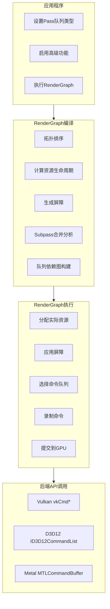
```mermaid
graph TB
    subgraph Application["应用程序"]
        A[设置Pass队列类型]
        B[启用高级功能]
        C[执行RenderGraph]
    end

    subgraph RenderGraphCompile["RenderGraph编译"]
        D[拓扑排序]
        E[计算资源生命周期]
        F[生成屏障]
        G[Subpass合并分析]
        H[队列依赖图构建]
    end

    subgraph RenderGraphExecute["RenderGraph执行"]
        I[分配实际资源]
        J[应用屏障]
        K[选择命令队列]
        L[录制命令]
        M[提交到GPU]
    end

    subgraph BackendAPI["后端API调用"]
        N[Vulkan vkCmd*]
        O[D3D12 ID3D12CommandList]
        P[Metal MTLCommandBuffer]
    end

    Application --> RenderGraphCompile
    RenderGraphCompile --> RenderGraphExecute
    RenderGraphExecute --> BackendAPI
```

---

## 十六、资源创建与后端图形API资源映射

### 16.1 资源类型架构图

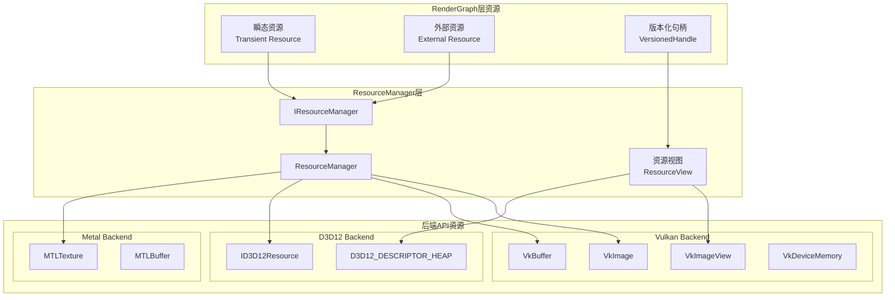
```mermaid
graph TB
    subgraph RenderGraphResources["RenderGraph层资源"]
        TR[瞬态资源<br>Transient Resource]
        ER[外部资源<br>External Resource]
        VR[版本化句柄<br>VersionedHandle]
    end

    subgraph ResourceManager["ResourceManager层"]
        IRM[IResourceManager]
        RM[ResourceManager]
        VR2[资源视图<br>ResourceView]
    end

    subgraph BackendResources["后端API资源"]
        subgraph Vulkan["Vulkan Backend"]
            VKI[VkImage]
            VKV[VkImageView]
            VKB[VkBuffer]
            VKM[VkDeviceMemory]
        end
        subgraph D3D12["D3D12 Backend"]
            D3R[ID3D12Resource]
            D3V[D3D12_DESCRIPTOR_HEAP]
        end
        subgraph Metal["Metal Backend"]
            MTT[MTLTexture]
            MTB[MTLBuffer]
        end
    end

    TR --> IRM
    ER --> IRM
    IRM --> RM
    RM --> VKI
    RM --> VKB
    RM --> D3R
    RM --> MTT
    VR --> VR2
    VR2 --> VKV
    VR2 --> D3V
```

### 16.2 资源创建完整流程

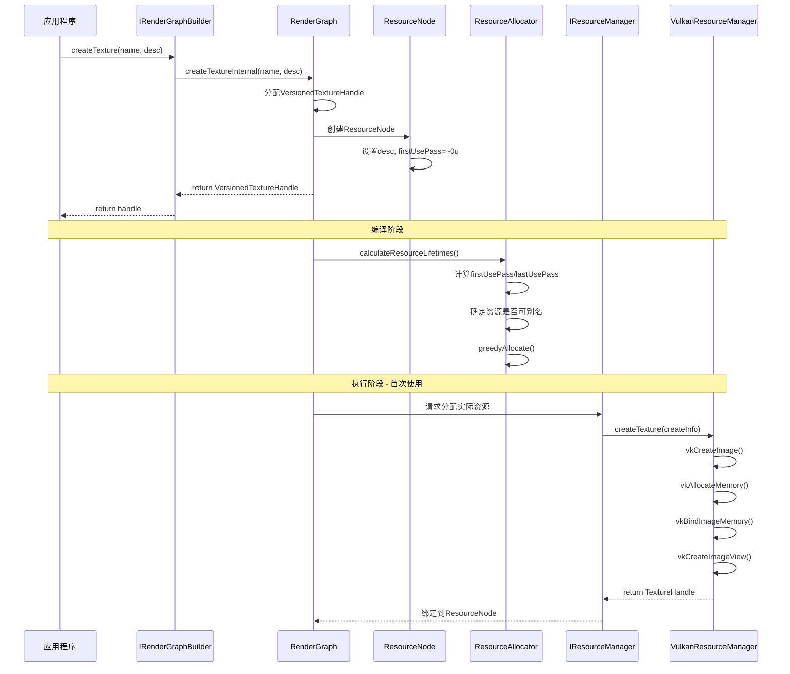
```mermaid
sequenceDiagram
    participant App as 应用程序
    participant RGB as IRenderGraphBuilder
    participant RG as RenderGraph
    participant RN as ResourceNode
    participant RA as ResourceAllocator
    participant RM as IResourceManager
    participant VR as VulkanResourceManager

    App->>RGB: createTexture(name, desc)
    RGB->>RG: createTextureInternal(name, desc)
    RG->>RG: 分配VersionedTextureHandle
    RG->>RN: 创建ResourceNode
    RN->>RN: 设置desc, firstUsePass=~0u
    RG-->>RGB: return VersionedTextureHandle
    RGB-->>App: return handle

    Note over App,VR: 编译阶段

    RG->>RA: calculateResourceLifetimes()
    RA->>RA: 计算firstUsePass/lastUsePass
    RA->>RA: 确定资源是否可别名
    RA->>RA: greedyAllocate()

    Note over App,VR: 执行阶段 - 首次使用

    RG->>RM: 请求分配实际资源
    RM->>VR: createTexture(createInfo)
    VR->>VR: vkCreateImage()
    VR->>VR: vkAllocateMemory()
    VR->>VR: vkBindImageMemory()
    VR->>VR: vkCreateImageView()
    VR-->>RM: return TextureHandle
    RM-->>RG: 绑定到ResourceNode
```

### 16.3 资源创建代码流程

```cpp
// RenderGraph层资源创建
class RenderGraph {
public:
    VersionedTextureHandle createTextureInternal(
            const char* name,
            const RenderGraphResourceDesc& desc) {
        // 1. 分配版本化句柄
        Handle index = nextResourceIndex++;
        u32 version = 0;
        VersionedTextureHandle handle(index, version);

        // 2. 创建资源节点（逻辑资源，此时无实际GPU资源）
        auto node = std::make_unique<ResourceNode>();
        node->handle = handle;
        node->name = name;
        node->type = desc.type;
        node->desc = desc;
        node->firstUsePass = ~0u;  // 未使用
        node->lastUsePass = 0;
        node->actualResource = ResourceHandle();  // 延迟分配
        node->isImported = false;

        resources[index] = std::move(node);

        return handle;
    }

    // 导入外部资源（如SwapChain BackBuffer）
    VersionedTextureHandle importTextureInternal(
            const char* name,
            TextureHandle externalTexture,
            ResourceState initialState) {
        Handle index = nextResourceIndex++;
        VersionedTextureHandle handle(index, 0);

        auto node = std::make_unique<ResourceNode>();
        node->handle = handle;
        node->name = name;
        node->actualResource = externalTexture;
        node->isImported = true;
        node->currentState = initialState;

        resources[index] = std::move(node);

        return handle;
    }
};

// ResourceManager层 - 实际GPU资源创建
class VulkanResourceManager : public IResourceManager {
public:
    TextureHandle createTexture(const TextureCreateInfo& createInfo) override {
        VulkanTexture texture;

        // 1. 创建VkImage
        VkImageCreateInfo imageInfo = {};
        imageInfo.sType = VK_STRUCTURE_TYPE_IMAGE_CREATE_INFO;
        imageInfo.imageType = convertToVkImageType(createInfo.type);
        imageInfo.format = convertToVkFormat(createInfo.format);
        imageInfo.extent = {createInfo.extent.width,
                           createInfo.extent.height,
                           createInfo.extent.depth};
        imageInfo.mipLevels = createInfo.mipLevels;
        imageInfo.arrayLayers = createInfo.arrayLayers;
        imageInfo.samples = VK_SAMPLE_COUNT_1_BIT;
        imageInfo.tiling = VK_IMAGE_TILING_OPTIMAL;
        imageInfo.usage = convertToVkImageUsage(createInfo.usage);
        imageInfo.initialLayout = VK_IMAGE_LAYOUT_UNDEFINED;

        vkCreateImage(device, &imageInfo, nullptr, &texture.image);

        // 2. 分配GPU内存
        VkMemoryRequirements memRequirements;
        vkGetImageMemoryRequirements(device, texture.image, &memRequirements);

        VkMemoryAllocateInfo allocInfo = {};
        allocInfo.sType = VK_STRUCTURE_TYPE_MEMORY_ALLOCATE_INFO;
        allocInfo.allocationSize = memRequirements.size;
        allocInfo.memoryTypeIndex = findMemoryType(
            memRequirements.memoryTypeBits,
            convertToVkMemoryType(createInfo.memoryType)
        );

        vkAllocateMemory(device, &allocInfo, nullptr, &texture.memory);
        vkBindImageMemory(device, texture.image, texture.memory, 0);

        // 3. 创建默认ImageView
        VkImageViewCreateInfo viewInfo = {};
        viewInfo.sType = VK_STRUCTURE_TYPE_IMAGE_VIEW_CREATE_INFO;
        viewInfo.image = texture.image;
        viewInfo.viewType = convertToVkImageViewType(createInfo.type);
        viewInfo.format = imageInfo.format;
        viewInfo.subresourceRange.aspectMask = getAspectMask(createInfo.format);
        viewInfo.subresourceRange.baseMipLevel = 0;
        viewInfo.subresourceRange.levelCount = createInfo.mipLevels;
        viewInfo.subresourceRange.baseArrayLayer = 0;
        viewInfo.subresourceRange.layerCount = createInfo.arrayLayers;

        vkCreateImageView(device, &viewInfo, nullptr, &texture.defaultView);

        // 4. 记录资源信息
        texture.info = createInfo;
        texture.currentLayout = VK_IMAGE_LAYOUT_UNDEFINED;

        // 5. 分配句柄并存储
        TextureHandle handle = textureHandleAllocator.allocate();
        textures[handle] = std::move(texture);

        return handle;
    }

    BufferHandle createBuffer(const BufferCreateInfo& createInfo) override {
        VulkanBuffer buffer;

        // 1. 创建VkBuffer
        VkBufferCreateInfo bufferInfo = {};
        bufferInfo.sType = VK_STRUCTURE_TYPE_BUFFER_CREATE_INFO;
        bufferInfo.size = createInfo.size;
        bufferInfo.usage = convertToVkBufferUsage(createInfo.usage);
        bufferInfo.sharingMode = VK_SHARING_MODE_EXCLUSIVE;

        vkCreateBuffer(device, &bufferInfo, nullptr, &buffer.buffer);

        // 2. 分配内存
        VkMemoryRequirements memRequirements;
        vkGetBufferMemoryRequirements(device, buffer.buffer, &memRequirements);

        VkMemoryAllocateInfo allocInfo = {};
        allocInfo.sType = VK_STRUCTURE_TYPE_MEMORY_ALLOCATE_INFO;
        allocInfo.allocationSize = memRequirements.size;
        allocInfo.memoryTypeIndex = findMemoryType(
            memRequirements.memoryTypeBits,
            convertToVkMemoryType(createInfo.memoryType)
        );

        vkAllocateMemory(device, &allocInfo, nullptr, &buffer.memory);
        vkBindBufferMemory(device, buffer.buffer, buffer.memory, 0);

        // 3. 如果是Upload/Readback内存，映射到CPU
        if (createInfo.memoryType == MemoryType::Upload ||
            createInfo.memoryType == MemoryType::Readback) {
            vkMapMemory(device, buffer.memory, 0, createInfo.size, 0, &buffer.mappedPtr);
        }

        buffer.info = createInfo;
        buffer.isMappable = (createInfo.memoryType != MemoryType::Default);

        BufferHandle handle = bufferHandleAllocator.allocate();
        buffers[handle] = std::move(buffer);

        return handle;
    }

    // 资源视图创建（SRV/UAV/RTV/DSV）
    ResourceViewHandle createResourceView(
            ResourceHandle resource,
            const ResourceViewDesc& desc) override {
        // 检查缓存
        ViewKey key{resource, desc};
        auto it = viewCache.find(key);
        if (it != viewCache.end()) {
            return it->second;
        }

        // 创建新的ImageView
        VkImageViewCreateInfo viewInfo = {};
        viewInfo.sType = VK_STRUCTURE_TYPE_IMAGE_VIEW_CREATE_INFO;
        viewInfo.image = getVulkanImage(resource);
        viewInfo.viewType = convertToVkViewType(desc.type);
        viewInfo.format = convertToVkFormat(desc.format);
        viewInfo.subresourceRange = convertToVkSubresourceRange(desc);

        VkImageView imageView;
        vkCreateImageView(device, &viewInfo, nullptr, &imageView);

        ResourceViewHandle handle = viewHandleAllocator.allocate();
        views[handle] = imageView;

        // 添加到缓存
        viewCache[key] = handle;

        return handle;
    }

private:
    struct VulkanTexture {
        VkImage image;
        VkDeviceMemory memory;
        VkImageView defaultView;
        VkImageLayout currentLayout;
        TextureCreateInfo info;
    };

    struct VulkanBuffer {
        VkBuffer buffer;
        VkDeviceMemory memory;
        void* mappedPtr = nullptr;
        BufferCreateInfo info;
        bool isMappable = false;
    };

    VkDevice device;
    std::unordered_map<TextureHandle, VulkanTexture> textures;
    std::unordered_map<BufferHandle, VulkanBuffer> buffers;
    std::unordered_map<ResourceViewHandle, VkImageView> views;
    std::unordered_map<ViewKey, ResourceViewHandle> viewCache;
};
```

### 16.4 D3D12 资源创建对比

```cpp
class D3D12ResourceManager : public IResourceManager {
public:
    TextureHandle createTexture(const TextureCreateInfo& createInfo) override {
        D3D12Texture texture;

        // 1. 描述资源
        D3D12_RESOURCE_DESC desc = {};
        desc.Dimension = convertToD3D12Dimension(createInfo.type);
        desc.Alignment = 0;
        desc.Width = createInfo.extent.width;
        desc.Height = createInfo.extent.height;
        desc.DepthOrArraySize = createInfo.extent.depth;
        desc.MipLevels = createInfo.mipLevels;
        desc.Format = convertToD3D12Format(createInfo.format);
        desc.SampleDesc.Count = 1;
        desc.Layout = D3D12_TEXTURE_LAYOUT_UNKNOWN;
        desc.Flags = convertToD3D12Flags(createInfo.usage);

        // 2. 确定堆属性
        D3D12_HEAP_PROPERTIES heapProps = {};
        heapProps.Type = convertToD3D12HeapType(createInfo.memoryType);

        // 3. 创建CommittedResource（D3D12常用Committed而非Placed）
        device->CreateCommittedResource(
            &heapProps,
            D3D12_HEAP_FLAG_NONE,
            &desc,
            D3D12_RESOURCE_STATE_COMMON,  // 初始状态
            nullptr,  // 不使用ClearValue
            IID_PPV_ARGS(&texture.resource)
        );

        // 4. 创建描述符（SRV/UAV/RTV/DSV在D3D12中是分开的）
        if (hasUsage(createInfo.usage, ResourceUsage::ShaderResource)) {
            D3D12_SHADER_RESOURCE_VIEW_DESC srvDesc = {};
            srvDesc.Format = desc.Format;
            srvDesc.ViewDimension = convertToD3DSRVDimension(createInfo.type);
            // ... 设置其他字段

            texture.srvHandle = descriptorHeap->alloc();
            device->CreateShaderResourceView(
                texture.resource.Get(),
                &srvDesc,
                texture.srvHandle.cpu
            );
        }

        if (hasUsage(createInfo.usage, ResourceUsage::RenderTarget)) {
            D3D12_RENDER_TARGET_VIEW_DESC rtvDesc = {};
            rtvDesc.Format = desc.Format;
            rtvDesc.ViewDimension = convertToD3DRTVDimension(createInfo.type);

            texture.rtvHandle = rtvDescriptorHeap->alloc();
            device->CreateRenderTargetView(
                texture.resource.Get(),
                &rtvDesc,
                texture.rtvHandle.cpu
            );
        }

        // D3D12不需要像Vulkan那样显式创建ImageView，
        // 而是在使用时通过描述符间接引用

        TextureHandle handle = textureHandleAllocator.allocate();
        textures[handle] = std::move(texture);

        return handle;
    }

    BufferHandle createBuffer(const BufferCreateInfo& createInfo) override {
        D3D12Buffer buffer;

        D3D12_RESOURCE_DESC desc = {};
        desc.Dimension = D3D12_RESOURCE_DIMENSION_BUFFER;
        desc.Width = createInfo.size;
        desc.Height = 1;
        desc.DepthOrArraySize = 1;
        desc.MipLevels = 1;
        desc.Format = DXGI_FORMAT_UNKNOWN;
        desc.SampleDesc.Count = 1;
        desc.Layout = D3D12_TEXTURE_LAYOUT_ROW_MAJOR;
        desc.Flags = convertToD3D12BufferFlags(createInfo.usage);

        D3D12_HEAP_PROPERTIES heapProps = {};
        heapProps.Type = convertToD3D12HeapType(createInfo.memoryType);

        D3D12_RESOURCE_STATES initialState = D3D12_RESOURCE_STATE_COMMON;
        if (createInfo.memoryType == MemoryType::Upload) {
            initialState = D3D12_RESOURCE_STATE_GENERIC_READ;
        } else if (createInfo.memoryType == MemoryType::Readback) {
            initialState = D3D12_RESOURCE_STATE_COPY_DEST;
        }

        device->CreateCommittedResource(
            &heapProps,
            D3D12_HEAP_FLAG_NONE,
            &desc,
            initialState,
            nullptr,
            IID_PPV_ARGS(&buffer.resource)
        );

        // 映射CPU可访问内存
        if (createInfo.memoryType == MemoryType::Upload ||
            createInfo.memoryType == MemoryType::Readback) {
            buffer.resource->Map(0, nullptr, &buffer.mappedPtr);
        }

        BufferHandle handle = bufferHandleAllocator.allocate();
        buffers[handle] = std::move(buffer);

        return handle;
    }

private:
    struct D3D12Texture {
        ComPtr<ID3D12Resource> resource;
        DescriptorHandle srvHandle;
        DescriptorHandle uavHandle;
        DescriptorHandle rtvHandle;
        DescriptorHandle dsvHandle;
    };

    struct D3D12Buffer {
        ComPtr<ID3D12Resource> resource;
        void* mappedPtr = nullptr;
        DescriptorHandle srvHandle;
        DescriptorHandle uavHandle;
    };

    ID3D12Device* device;
    std::unique_ptr<DescriptorHeap> descriptorHeap;
    std::unique_ptr<DescriptorHeap> rtvDescriptorHeap;
    std::unique_ptr<DescriptorHeap> dsvDescriptorHeap;
};
```

### 16.5 内存类型映射

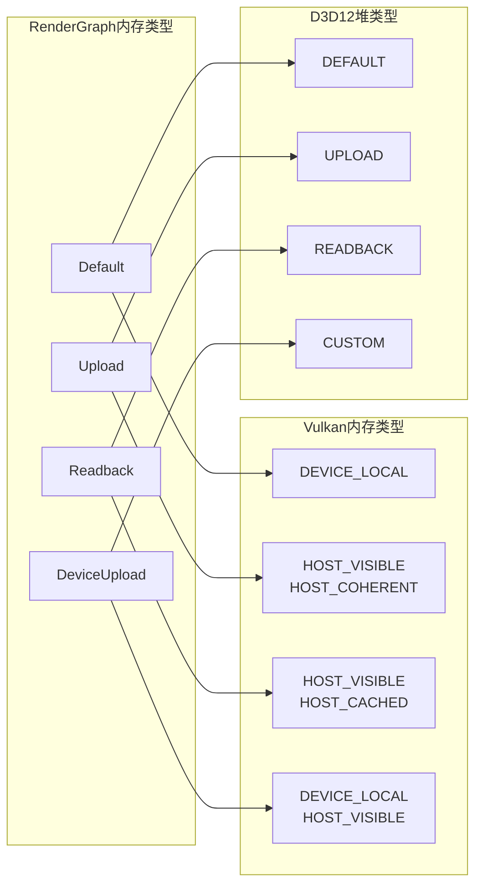
```mermaid
graph LR
    subgraph MemoryTypes["RenderGraph内存类型"]
        MT1[Default]
        MT2[Upload]
        MT3[Readback]
        MT4[DeviceUpload]
    end

    subgraph VulkanMemory["Vulkan内存类型"]
        VK1[DEVICE_LOCAL]
        VK2[HOST_VISIBLE<br>HOST_COHERENT]
        VK3[HOST_VISIBLE<br>HOST_CACHED]
        VK4[DEVICE_LOCAL<br>HOST_VISIBLE]
    end

    subgraph D3D12Memory["D3D12堆类型"]
        D31[DEFAULT]
        D32[UPLOAD]
        D33[READBACK]
        D34[CUSTOM]
    end

    MT1 --> VK1
    MT2 --> VK2
    MT3 --> VK3
    MT4 --> VK4

    MT1 --> D31
    MT2 --> D32
    MT3 --> D33
    MT4 --> D34
```

### 16.6 资源状态转换映射

```cpp
// Vulkan资源状态转换
class VulkanResourceManager {
public:
    // RenderGraph ResourceState -> Vulkan Image Layout
    static VkImageLayout convertToVkImageLayout(ResourceState state) {
        switch (state) {
            case ResourceState::Undefined:
                return VK_IMAGE_LAYOUT_UNDEFINED;
            case ResourceState::Common:
                return VK_IMAGE_LAYOUT_GENERAL;
            case ResourceState::RenderTarget:
                return VK_IMAGE_LAYOUT_COLOR_ATTACHMENT_OPTIMAL;
            case ResourceState::DepthWrite:
                return VK_IMAGE_LAYOUT_DEPTH_STENCIL_ATTACHMENT_OPTIMAL;
            case ResourceState::DepthRead:
                return VK_IMAGE_LAYOUT_DEPTH_STENCIL_READ_ONLY_OPTIMAL;
            case ResourceState::ShaderResource:
                return VK_IMAGE_LAYOUT_SHADER_READ_ONLY_OPTIMAL;
            case ResourceState::UnorderedAccess:
                return VK_IMAGE_LAYOUT_GENERAL;
            case ResourceState::CopySource:
                return VK_IMAGE_LAYOUT_TRANSFER_SRC_OPTIMAL;
            case ResourceState::CopyDest:
                return VK_IMAGE_LAYOUT_TRANSFER_DST_OPTIMAL;
            case ResourceState::Present:
                return VK_IMAGE_LAYOUT_PRESENT_SRC_KHR;
            default:
                return VK_IMAGE_LAYOUT_GENERAL;
        }
    }

    // 自动推断Pipeline Stage
    static VkPipelineStageFlags inferPipelineStage(ResourceState state) {
        switch (state) {
            case ResourceState::RenderTarget:
                return VK_PIPELINE_STAGE_COLOR_ATTACHMENT_OUTPUT_BIT;
            case ResourceState::DepthWrite:
            case ResourceState::DepthRead:
                return VK_PIPELINE_STAGE_EARLY_FRAGMENT_TESTS_BIT |
                       VK_PIPELINE_STAGE_LATE_FRAGMENT_TESTS_BIT;
            case ResourceState::ShaderResource:
                return VK_PIPELINE_STAGE_VERTEX_SHADER_BIT |
                       VK_PIPELINE_STAGE_FRAGMENT_SHADER_BIT;
            case ResourceState::UnorderedAccess:
                return VK_PIPELINE_STAGE_COMPUTE_SHADER_BIT;
            case ResourceState::CopySource:
            case ResourceState::CopyDest:
                return VK_PIPELINE_STAGE_TRANSFER_BIT;
            default:
                return VK_PIPELINE_STAGE_TOP_OF_PIPE_BIT;
        }
    }
};

// D3D12资源状态转换
class D3D12ResourceManager {
public:
    // RenderGraph ResourceState -> D3D12 Resource State
    static D3D12_RESOURCE_STATES convertToD3D12State(ResourceState state) {
        switch (state) {
            case ResourceState::Common:
                return D3D12_RESOURCE_STATE_COMMON;
            case ResourceState::VertexBuffer:
                return D3D12_RESOURCE_STATE_VERTEX_AND_CONSTANT_BUFFER;
            case ResourceState::IndexBuffer:
                return D3D12_RESOURCE_STATE_INDEX_BUFFER;
            case ResourceState::ConstantBuffer:
                return D3D12_RESOURCE_STATE_VERTEX_AND_CONSTANT_BUFFER;
            case ResourceState::RenderTarget:
                return D3D12_RESOURCE_STATE_RENDER_TARGET;
            case ResourceState::DepthWrite:
                return D3D12_RESOURCE_STATE_DEPTH_WRITE;
            case ResourceState::DepthRead:
                return D3D12_RESOURCE_STATE_DEPTH_READ;
            case ResourceState::ShaderResource:
                return D3D12_RESOURCE_STATE_PIXEL_SHADER_RESOURCE |
                       D3D12_RESOURCE_STATE_NON_PIXEL_SHADER_RESOURCE;
            case ResourceState::UnorderedAccess:
                return D3D12_RESOURCE_STATE_UNORDERED_ACCESS;
            case ResourceState::CopySource:
                return D3D12_RESOURCE_STATE_COPY_SOURCE;
            case ResourceState::CopyDest:
                return D3D12_RESOURCE_STATE_COPY_DEST;
            case ResourceState::Present:
                return D3D12_RESOURCE_STATE_PRESENT;
            default:
                return D3D12_RESOURCE_STATE_COMMON;
        }
    }
};
```

### 16.7 资源生命周期与延迟分配

```cpp
class RenderGraph {
public:
    // 延迟分配策略
    void allocateResourceLazy(VersionedResourceHandle handle) {
        auto* node = getResourceNode(handle);
        if (!node || node->isImported) return;

        auto* alloc = getAllocation(handle);
        if (!alloc || alloc->isAllocated) return;

        // 1. 检查是否有别名资源可以复用
        if (alloc->isAliased && alloc->aliasedWith.isValid()) {
            auto* aliasedNode = getResourceNode(alloc->aliasedWith);
            if (aliasedNode && aliasedNode->actualResource.isValid()) {
                // 复用别名资源的内存，创建新的ImageView
                alloc->actualResource = createAliasedTexture(
                    aliasedNode->actualResource,
                    node->desc
                );
                alloc->isAllocated = true;
                node->actualResource = alloc->actualResource;
                return;
            }
        }

        // 2. 创建新的GPU资源
        TextureCreateInfo createInfo;
        createInfo.extent = node->desc.extent;
        createInfo.format = node->desc.format;
        createInfo.mipLevels = node->desc.mipLevels;
        createInfo.arrayLayers = node->desc.arrayLayers;
        createInfo.usage = node->desc.usage;
        createInfo.memoryType = MemoryType::Default;  // 瞬态资源使用Device Local

        TextureHandle texture = resourceManager->createTexture(createInfo);
        alloc->actualResource = texture;
        alloc->isAllocated = true;
        node->actualResource = texture;
    }

    // 资源别名创建
    TextureHandle createAliasedTexture(TextureHandle source,
                                       const RenderGraphResourceDesc& desc) {
        // Vulkan: 使用相同的VkDeviceMemory，不同的VkImage
        // D3D12: 使用CreatePlacedResource在相同的Heap中
        // 这里返回新的TextureHandle，指向新的Image但共享内存
        return resourceManager->createAliasedTexture(source, desc);
    }

    // 执行时按需分配
    void executePass(RenderPassNode* pass, IRenderPassContext* context) {
        // 确保输入资源已分配
        for (const auto& input : pass->inputs) {
            auto* node = getResourceNode(input.handle);
            if (!node->isImported && !node->actualResource.isValid()) {
                allocateResourceLazy(input.handle);
            }
        }

        // 确保输出资源已分配
        for (const auto& output : pass->outputs) {
            auto* node = getResourceNode(output.handle);
            if (!node->isImported && !node->actualResource.isValid()) {
                allocateResourceLazy(output.handle);
            }
        }

        // 执行Pass...
    }
};
```

### 16.8 资源视图缓存与复用

```cpp
class RenderPassContext : public IRenderPassContext {
public:
    ResourceViewHandle getTextureView(VersionedTextureHandle handle,
                                     const TextureViewDesc& desc) override {
        // 1. 生成缓存Key
        u64 key = computeViewCacheKey(handle, desc);

        // 2. 检查缓存
        auto it = viewCache.find(key);
        if (it != viewCache.end()) {
            return it->second;
        }

        // 3. 获取实际资源
        TextureHandle texture = getTexture(handle);

        // 4. 创建新视图
        ResourceViewHandle view = resourceManager->createResourceView(texture, desc);

        // 5. 加入缓存
        viewCache[key] = view;
        cachedViews.push_back(view);

        return view;
    }

    void clearViewCache() {
        // 延迟释放，可能在多帧内复用
        for (auto view : cachedViews) {
            resourceManager->releaseResourceView(view);
        }
        cachedViews.clear();
        viewCache.clear();
    }

private:
    std::unordered_map<u64, ResourceViewHandle> viewCache;
    std::vector<ResourceViewHandle> cachedViews;

    u64 computeViewCacheKey(VersionedTextureHandle handle,
                            const TextureViewDesc& desc) {
        // 组合handle和desc的哈希
        u64 key = 0;
        key ^= std::hash<Handle>{}(handle.getIndex());
        key ^= std::hash<u32>{}(handle.getVersion()) << 32;
        key ^= std::hash<u32>{}(static_cast<u32>(desc.type));
        key ^= std::hash<u32>{}(static_cast<u32>(desc.format)) << 8;
        key ^= std::hash<u32>{}(desc.baseMipLevel) << 16;
        key ^= std::hash<u32>{}(desc.baseArrayLayer) << 24;
        return key;
    }
};
```

---

## 十七、接口速查表

| 接口                    | 用途        | 关键方法                                                                                                                          |
|-----------------------|-----------|-------------------------------------------------------------------------------------------------------------------------------|
| `IRenderSystem`       | 渲染系统顶层    | `initialize()`, `beginFrame()`, `endFrame()`, `getRenderGraphManager()`                                                       |
| `IRenderGraphManager` | 渲染图管理     | `createRenderGraph()`, `beginBuild()`, `endBuild()`, `execute()`                                                              |
| `IRenderGraphBuilder` | 构建渲染图     | `createTexture()`, `addPass()`, `readTexture()`, `writeTexture()`, `queueSync()`, `executeNextAsync()`, `beginSubpassGroup()` |
| `IRenderPassContext`  | Pass执行上下文 | `setPipeline()`, `setDescriptorSet()`, `draw()`, `dispatch()`, `getTextureView()`                                             |
| `ICommandBuffer`      | GPU命令录制   | `bindPipeline()`, `drawIndexed()`, `pipelineBarrier()`, `beginSplitBarrier()`, `endSplitBarrier()`, `aliasingBarrier()`       |
| `IResourceManager`    | 资源管理      | `createTexture()`, `createBuffer()`, `createResourceView()`                                                                   |
| `IPipelineManager`    | 管线管理      | `createGraphicsPipeline()`, `createShader()`                                                                                  |
| `ICommandQueue`       | 命令队列      | `submit()`, `present()`, `signalFence()`, `waitFence()`                                                                       |

---

## 十八、多队列与异步计算详细设计

### 18.1 队列类型与配置

```cpp
// 支持的队列类型
enum class QueueType {
    Graphics,       // 图形队列（支持所有操作）
    Compute,        // 异步计算队列
    Transfer,       // 异步传输队列
    SparseBinding,  // 稀疏绑定队列
    Count
};

// 队列配置
struct QueueCreateInfo {
    QueueType type = QueueType::Graphics;
    u32 familyIndex = InvalidQueueFamily;
    u32 count = 1;
    QueuePriority priority = QueuePriority::Normal;
};

// RenderSystem配置
struct RenderSystemConfig {
    u32 graphicsQueueCount = 1;
    u32 computeQueueCount = 0;   // 0表示不启用
    u32 transferQueueCount = 0;  // 0表示不启用
};
```

### 18.2 多队列架构流程

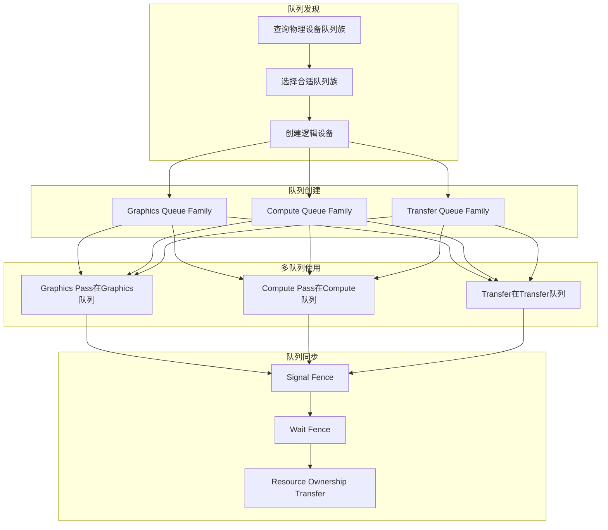
```mermaid
graph TB
    subgraph QueueDiscovery["队列发现"]
        QD1[查询物理设备队列族]
        QD2[选择合适队列族]
        QD3[创建逻辑设备]
    end

    subgraph QueueCreation["队列创建"]
        QC1[Graphics Queue Family]
        QC2[Compute Queue Family]
        QC3[Transfer Queue Family]
    end

    subgraph MultiQueueUsage["多队列使用"]
        MU1[Graphics Pass在Graphics队列]
        MU2[Compute Pass在Compute队列]
        MU3[Transfer在Transfer队列]
    end

    subgraph QueueSynchronization["队列同步"]
        QS1[Signal Fence]
        QS2[Wait Fence]
        QS3[Resource Ownership Transfer]
    end

    QD1 --> QD2 --> QD3
    QD3 --> QC1 & QC2 & QC3
    QC1 & QC2 & QC3 --> MU1 & MU2 & MU3
    MU1 & MU2 & MU3 --> QS1
    QS1 --> QS2 --> QS3
```

### 18.3 异步计算Pass编写

```cpp
// 1. 配置异步计算队列
RenderSystemConfig config;
config.computeQueueCount = 1;  // 启用1个计算队列
renderSystem->initialize(config);

// 2. 配置RenderGraph使用计算队列
auto* rgm = renderSystem->getRenderGraphManager();
rgm->setQueueFamilyIndex(QueueType::Compute, 
    renderSystem->getComputeQueueFamilyIndex());

// 3. 创建异步计算Pass
RenderPassDesc particleComputeDesc;
particleComputeDesc.name = "ParticleCompute";
particleComputeDesc.type = RenderPassType::Compute;
particleComputeDesc.queueType = QueueType::Compute;  // 指定计算队列
particleComputeDesc.asyncCompute = true;              // 标记异步

particleComputeDesc.executeCallback = [](IRenderPassContext& ctx) {
    ctx.setPipeline(particlePipeline);
    ctx.setDescriptorSet(0, particleDataSet);
    ctx.dispatch(256, 1, 1);
};

auto computePass = builder->addPass(particleComputeDesc);

// 4. 添加队列同步点
builder->queueSync(computePass, QueueType::Compute, QueueType::Graphics);

// 5. 后续图形Pass使用计算结果
RenderPassDesc renderPassDesc;
renderPassDesc.name = "RenderParticles";
renderPassDesc.type = RenderPassType::Graphics;
// 可以安全读取粒子计算结果
```

### 18.4 队列同步实现

```cpp
class RenderGraph {
private:
    void insertQueueSyncBarrier(const QueueSyncPoint& syncPoint, u32 passIndex) {
        // 1. 在源队列Signal Fence
        // 2. 在目标队列Wait Fence
        // 3. 处理资源所有权转移
        
        BarrierInfo barrier;
        barrier.isQueueTransfer = true;
        barrier.srcQueue = syncPoint.srcQueue;
        barrier.dstQueue = syncPoint.dstQueue;
        barrier.srcPass = passIndex;
        barrier.dstPass = passIndex + 1;
        
        barriers.push_back(barrier);
    }
    
    void buildQueueDependencyGraph() {
        // 构建跨队列的依赖图
        // 确定哪些Pass可以在不同队列并行执行
        // 最小化同步点数量
    }
};

// Vulkan队列同步实现
class VulkanCommandQueue {
public:
    void submitWithSignal(ICommandBuffer* cmdBuffer, FenceHandle signalFence) {
        VkSubmitInfo submitInfo = {};
        submitInfo.sType = VK_STRUCTURE_TYPE_SUBMIT_INFO;
        
        VkCommandBuffer cmd = getVkCommandBuffer(cmdBuffer);
        submitInfo.commandBufferCount = 1;
        submitInfo.pCommandBuffers = &cmd;
        
        VkFence fence = getVulkanFence(signalFence);
        vkQueueSubmit(queue, 1, &submitInfo, fence);
    }
    
    void submitWithWait(ICommandBuffer* cmdBuffer, 
                        const std::vector<FenceHandle>& waitFences) {
        VkSubmitInfo submitInfo = {};
        submitInfo.sType = VK_STRUCTURE_TYPE_SUBMIT_INFO;
        
        // 设置等待的Fences
        std::vector<VkSemaphore> waitSemaphores;
        for (auto fence : waitFences) {
            // 将Fence转换为Semaphore或使用Timeline Semaphore
            waitSemaphores.push_back(getTimelineSemaphore(fence));
        }
        
        submitInfo.waitSemaphoreCount = waitSemaphores.size();
        submitInfo.pWaitSemaphores = waitSemaphores.data();
        
        VkPipelineStageFlags waitStages[] = {
            VK_PIPELINE_STAGE_ALL_COMMANDS_BIT
        };
        submitInfo.pWaitDstStageMask = waitStages;
        
        VkCommandBuffer cmd = getVkCommandBuffer(cmdBuffer);
        submitInfo.commandBufferCount = 1;
        submitInfo.pCommandBuffers = &cmd;
        
        vkQueueSubmit(queue, 1, &submitInfo, VK_NULL_HANDLE);
    }
};
```

---

## 十九、Split Barrier实现细节

### 19.1 Split Barrier原理


```mermaid
sequenceDiagram
    participant Pass1 as Pass N
    participant BarrierBegin as Split Barrier Begin
    participant Compute as Long Compute Task
    participant BarrierEnd as Split Barrier End
    participant Pass2 as Pass N+2

    Pass1->>BarrierBegin: 释放资源访问权
    BarrierBegin->>Compute: 开始长时间计算
    Note over Compute: 计算期间资源可被其他操作使用
    Compute->>BarrierEnd: 计算完成
    BarrierEnd->>Pass2: 重新获取资源访问权
    Pass2->>Pass2: 使用资源
```

### 19.2 Split Barrier代码示例

```cpp
// 1. 启用Split Barrier
rgm->enableSplitBarriers(true);

// 2. 在Pass中使用Split Barrier
RenderPassDesc longComputeDesc;
longComputeDesc.name = "LongCompute";
longComputeDesc.type = RenderPassType::Compute;

longComputeDesc.setupCallback = [](IRenderPassContext& ctx) {
    // 开始Split Barrier - 释放资源让其他队列使用
    std::vector<ResourceBarrier> beginBarriers = {
        ResourceBarrier::image(gbufferTexture,
            ImageLayout::ColorAttachment, ImageLayout::ShaderReadOnly,
            PipelineStage::ColorAttachmentOutput, PipelineStage::TopOfPipe,
            AccessFlags::ColorAttachmentWrite, AccessFlags::None)
    };
    
    ctx.getCommandBuffer()->beginSplitBarrier(
        beginBarriers, 
        PipelineStage::ColorAttachmentOutput
    );
};

longComputeDesc.executeCallback = [](IRenderPassContext& ctx) {
    // 执行长时间计算
    ctx.setPipeline(heavyComputePipeline);
    ctx.dispatch(1024, 1024, 1);
};

longComputeDesc.teardownCallback = [](IRenderPassContext& ctx) {
    // 结束Split Barrier - 重新获取资源
    std::vector<ResourceBarrier> endBarriers = {
        ResourceBarrier::image(gbufferTexture,
            ImageLayout::ShaderReadOnly, ImageLayout::ColorAttachment,
            PipelineStage::BottomOfPipe, PipelineStage::FragmentShader,
            AccessFlags::None, AccessFlags::ShaderRead)
    };
    
    ctx.getCommandBuffer()->endSplitBarrier(
        endBarriers,
        PipelineStage::FragmentShader
    );
};
```

### 19.3 Vulkan Split Barrier实现

```cpp
class VulkanCommandBuffer : public ICommandBuffer {
public:
    void beginSplitBarrier(const std::vector<ResourceBarrier>& barriers,
                           PipelineStage srcStage) override {
        // Vulkan使用Event实现Split Barrier
        VkEventCreateInfo eventInfo = {};
        eventInfo.sType = VK_STRUCTURE_TYPE_EVENT_CREATE_INFO;
        vkCreateEvent(device, &eventInfo, nullptr, &splitEvent);

        // 设置Event - 标记资源已准备好被释放
        vkCmdSetEvent(commandBuffer, splitEvent, convertPipelineStage(srcStage));
        
        // 记录需要等待的屏障信息
        pendingSplitBarriers = barriers;
        splitBarrierSrcStage = srcStage;
    }

    void endSplitBarrier(const std::vector<ResourceBarrier>& barriers,
                         PipelineStage dstStage) override {
        // 等待之前设置的Event
        vkCmdWaitEvents(
            commandBuffer,
            1, &splitEvent,
            convertPipelineStage(PipelineStage::TopOfPipe),
            convertPipelineStage(dstStage),
            0, nullptr,  // memory barriers
            0, nullptr,  // buffer barriers
            0, nullptr   // image barriers - 我们在后面手动处理
        );
        
        // 执行实际的资源屏障转换
        std::vector<VkImageMemoryBarrier> imageBarriers;
        for (const auto& barrier : barriers) {
            VkImageMemoryBarrier vkBarrier = {};
            vkBarrier.sType = VK_STRUCTURE_TYPE_IMAGE_MEMORY_BARRIER;
            vkBarrier.srcAccessMask = convertAccessFlags(barrier.srcAccess);
            vkBarrier.dstAccessMask = convertAccessFlags(barrier.dstAccess);
            vkBarrier.oldLayout = convertImageLayout(barrier.oldLayout);
            vkBarrier.newLayout = convertImageLayout(barrier.newLayout);
            vkBarrier.image = getVulkanImage(barrier.texture);
            vkBarrier.subresourceRange = convertSubresourceRange(barrier.subresourceRange);
            imageBarriers.push_back(vkBarrier);
        }
        
        vkCmdPipelineBarrier(
            commandBuffer,
            convertPipelineStage(splitBarrierSrcStage),
            convertPipelineStage(dstStage),
            0,
            0, nullptr,
            0, nullptr,
            imageBarriers.size(), imageBarriers.data()
        );

        vkDestroyEvent(device, splitEvent, nullptr);
        splitEvent = VK_NULL_HANDLE;
    }

private:
    VkCommandBuffer commandBuffer;
    VkDevice device;
    VkEvent splitEvent = VK_NULL_HANDLE;
    std::vector<ResourceBarrier> pendingSplitBarriers;
    PipelineStage splitBarrierSrcStage;
};
```

### 19.4 D3D12 Split Barrier实现

```cpp
class D3D12CommandBuffer : public ICommandBuffer {
public:
    void beginSplitBarrier(const std::vector<ResourceBarrier>& barriers,
                           PipelineStage srcStage) override {
        // D3D12 Split Barrier使用Begin-only transition
        std::vector<CD3DX12_RESOURCE_BARRIER> beginBarriers;
        
        for (const auto& barrier : barriers) {
            D3D12_RESOURCE_BARRIER d3dBarrier = {};
            d3dBarrier.Type = D3D12_RESOURCE_BARRIER_TYPE_TRANSITION;
            d3dBarrier.Flags = D3D12_RESOURCE_BARRIER_FLAG_BEGIN_ONLY;
            d3dBarrier.Transition.pResource = getD3D12Resource(barrier.texture);
            d3dBarrier.Transition.StateBefore = convertD3D12State(barrier.oldLayout);
            d3dBarrier.Transition.StateAfter = convertD3D12State(barrier.newLayout);
            d3dBarrier.Transition.Subresource = D3D12_RESOURCE_BARRIER_ALL_SUBRESOURCES;
            
            beginBarriers.push_back(d3dBarrier);
        }
        
        commandList->ResourceBarrier(beginBarriers.size(), beginBarriers.data());
    }

    void endSplitBarrier(const std::vector<ResourceBarrier>& barriers,
                         PipelineStage dstStage) override {
        // D3D12 Split Barrier End-only transition
        std::vector<CD3DX12_RESOURCE_BARRIER> endBarriers;
        
        for (const auto& barrier : barriers) {
            D3D12_RESOURCE_BARRIER d3dBarrier = {};
            d3dBarrier.Type = D3D12_RESOURCE_BARRIER_TYPE_TRANSITION;
            d3dBarrier.Flags = D3D12_RESOURCE_BARRIER_FLAG_END_ONLY;
            d3dBarrier.Transition.pResource = getD3D12Resource(barrier.texture);
            d3dBarrier.Transition.StateBefore = convertD3D12State(barrier.oldLayout);
            d3dBarrier.Transition.StateAfter = convertD3D12State(barrier.newLayout);
            
            endBarriers.push_back(d3dBarrier);
        }
        
        commandList->ResourceBarrier(endBarriers.size(), endBarriers.data());
    }
};
```

### 19.5 编译时Split Barrier优化

```cpp
class BarrierManager {
public:
    std::vector<BarrierInfo> generateBarriers(
        const std::vector<RenderGraphPassHandle>& executionOrder) {
        
        std::vector<BarrierInfo> barriers;
        
        for (u32 i = 0; i < executionOrder.size(); ++i) {
            auto* pass = getPassNode(executionOrder[i]);
            
            // 检测是否可以使用Split Barrier
            if (canUseSplitBarrier(pass, i)) {
                BarrierInfo beginBarrier;
                beginBarrier.isSplitBarrier = true;
                beginBarrier.splitPhase = SplitBarrierPhase::Begin;
                beginBarrier.srcPass = i;
                beginBarrier.splitCompletionPass = findCompletionPass(i);
                barriers.push_back(beginBarrier);
                
                BarrierInfo endBarrier;
                endBarrier.isSplitBarrier = true;
                endBarrier.splitPhase = SplitBarrierPhase::End;
                endBarrier.srcPass = beginBarrier.splitCompletionPass;
                barriers.push_back(endBarrier);
            }
        }
        
        return barriers;
    }
    
private:
    bool canUseSplitBarrier(RenderPassNode* pass, u32 passIndex) {
        // 判断条件：
        // 1. Pass执行时间较长（计算Pass）
        // 2. 资源在后续多个Pass中不被使用
        // 3. 有足够的时间间隙
        return pass->type == RenderPassType::Compute &&
               pass->asyncCompute &&
               getEstimatedDuration(pass) > threshold;
    }
};
```

---

## 二十、Subpass合并优化细节

### 20.1 Subpass合并流程


```mermaid
flowchart LR
    A[GBuffer Base Pass] --> B[Lighting Pass]
    B --> C[Post Process]
    
    subgraph WithoutMerging["未合并 - 3个RenderPass"]
        A1[Begin RP 1] --> A2[Draw] --> A3[End RP 1]
        B1[Begin RP 2] --> B2[Draw] --> B3[End RP 2]
        C1[Begin RP 3] --> C2[Draw] --> C3[End RP 3]
    end
    
    subgraph WithMerging["合并后 - 1个RenderPass with 3 Subpasses"]
        M1[Begin RP] --> M2[Subpass 0] --> M3[Next Subpass]
        M3 --> M4[Subpass 1] --> M5[Next Subpass]
        M5 --> M6[Subpass 2] --> M7[End RP]
    end
```

### 20.2 Subpass合并代码示例

```cpp
// 1. 启用Subpass合并
rgm->enableSubpassMerging(true);

// 2. 开始Subpass分组
builder->beginSubpassGroup("DeferredShading");

// 3. 添加可合并的Pass
RenderPassDesc basePassDesc;
basePassDesc.name = "GBufferBase";
basePassDesc.type = RenderPassType::Graphics;
basePassDesc.colorTargets = {albedo, normal, depth};
basePassDesc.mergeWithNext = true;  // 标记可合并
basePassDesc.subpassIndex = 0;
auto basePass = builder->addPass(basePassDesc);

RenderPassDesc lightingPassDesc;
lightingPassDesc.name = "DeferredLighting";
lightingPassDesc.type = RenderPassType::Graphics;
lightingPassDesc.inputs = {albedo, normal};  // Input attachments
lightingPassDesc.colorTargets = {lighting};
lightingPassDesc.mergeWithNext = true;
lightingPassDesc.subpassIndex = 1;
auto lightingPass = builder->addPass(lightingPassDesc);

RenderPassDesc compositePassDesc;
compositePassDesc.name = "Composite";
compositePassDesc.type = RenderPassType::Graphics;
compositePassDesc.inputs = {lighting, depth};
compositePassDesc.colorTargets = {finalImage};
compositePassDesc.subpassIndex = 2;
auto compositePass = builder->addPass(compositePassDesc);

builder->endSubpassGroup();
```

### 20.3 Subpass编译逻辑

```cpp
class RenderGraphCompiler {
private:
    void findMergeablePasses() {
        std::vector<std::vector<RenderGraphPassHandle>> groups;
        std::vector<RenderGraphPassHandle> currentGroup;
        
        for (auto passHandle : executionOrder) {
            auto* pass = getPassNode(passHandle);
            
            if (pass->mergeWithNext || !currentGroup.empty()) {
                currentGroup.push_back(passHandle);
                
                if (!pass->mergeWithNext) {
                    // 组结束
                    if (currentGroup.size() > 1) {
                        groups.push_back(currentGroup);
                        markAsSubpassGroup(currentGroup);
                    }
                    currentGroup.clear();
                }
            }
        }
    }
    
    void buildSubpassGroups() {
        for (const auto& group : subpassGroups) {
            RenderPassAttachmentDesc renderPassDesc;
            
            // 收集所有附件
            for (u32 i = 0; i < group.size(); ++i) {
                auto* pass = getPassNode(group[i]);
                
                SubpassDesc subpass;
                for (auto colorTarget : pass->colorTargets) {
                    subpass.colorAttachments.push_back(
                        getAttachmentIndex(colorTarget)
                    );
                }
                if (pass->depthStencilTarget.isValid()) {
                    subpass.depthStencilAttachment = 
                        getAttachmentIndex(pass->depthStencilTarget);
                }
                
                // 设置Input Attachments
                for (const auto& input : pass->inputs) {
                    subpass.inputAttachments.push_back(
                        getAttachmentIndex(input.handle)
                    );
                }
                
                renderPassDesc.subpasses.push_back(subpass);
                pass->isSubpassMerged = true;
                pass->subpassIndex = i;
            }
            
            // 生成Subpass依赖
            for (u32 i = 1; i < group.size(); ++i) {
                SubpassDependency dep;
                dep.srcSubpass = i - 1;
                dep.dstSubpass = i;
                dep.srcStageMask = PipelineStage::ColorAttachmentOutput;
                dep.dstStageMask = PipelineStage::FragmentShader;
                dep.srcAccessMask = AccessFlags::ColorAttachmentWrite;
                dep.dstAccessMask = AccessFlags::InputAttachmentRead;
                dep.byRegion = true;  // TBR优化关键
                
                renderPassDesc.dependencies.push_back(dep);
            }
            
            mergedRenderPasses.push_back(renderPassDesc);
        }
    }
};
```

### 20.4 TBR（Tile-Based Rendering）优化

```cpp
// 移动GPU的TBR优化
class TBRRenderer {
public:
    void optimizeForTBR(RenderGraph& graph) {
        // 1. 最大化Subpass合并
        // 减少GMEM（GPU Tile Memory）和主存之间的数据传输
        
        // 2. 标记Transient附件
        // 不需要存储到主存的附件
        for (auto& [handle, node] : graph.resources) {
            if (isUsedInSingleSubpass(node)) {
                node->desc.usage |= ResourceUsage::Transient;
            }
        }
        
        // 3. 设置LoadOp/StoreOp优化
        for (auto& pass : graph.passes) {
            for (auto& target : pass.colorTargets) {
                auto* node = graph.getResourceNode(target);
                
                if (node->isTransient) {
                    // Transient附件不需要Load或Store
                    node->desc.loadOp = LoadOp::DontCare;
                    node->desc.storeOp = StoreOp::DontCare;
                }
            }
        }
    }
    
private:
    bool isUsedInSingleSubpass(ResourceNode* node) {
        // 检查资源是否只在单个Subpass中使用
        return node->firstUsePass == node->lastUsePass &&
               !node->isUsedInSubsequentPass;
    }
};
```

### 20.5 Vulkan Subpass实现

```cpp
class VulkanRenderPassBuilder {
public:
    VkRenderPass createRenderPass(const RenderPassAttachmentDesc& desc) {
        // 附件描述
        std::vector<VkAttachmentDescription> attachments;
        for (const auto& attach : desc.attachments) {
            VkAttachmentDescription attachment = {};
            attachment.format = convertFormat(attach.format);
            attachment.samples = VK_SAMPLE_COUNT_1_BIT;
            attachment.loadOp = convertLoadOp(attach.loadOp);
            attachment.storeOp = convertStoreOp(attach.storeOp);
            attachment.stencilLoadOp = VK_ATTACHMENT_LOAD_OP_DONT_CARE;
            attachment.stencilStoreOp = VK_ATTACHMENT_STORE_OP_DONT_CARE;
            attachment.initialLayout = VK_IMAGE_LAYOUT_UNDEFINED;
            attachment.finalLayout = VK_IMAGE_LAYOUT_SHADER_READ_ONLY_OPTIMAL;
            attachments.push_back(attachment);
        }
        
        // Subpass描述
        std::vector<VkSubpassDescription> subpasses;
        std::vector<std::vector<VkAttachmentReference>> colorRefs;
        std::vector<std::vector<VkAttachmentReference>> inputRefs;
        std::vector<VkAttachmentReference> depthRefs;
        
        for (const auto& subpass : desc.subpasses) {
            VkSubpassDescription spDesc = {};
            spDesc.pipelineBindPoint = VK_PIPELINE_BIND_POINT_GRAPHICS;
            
            // Color attachments
            std::vector<VkAttachmentReference> colors;
            for (u32 idx : subpass.colorAttachments) {
                VkAttachmentReference ref = {};
                ref.attachment = idx;
                ref.layout = VK_IMAGE_LAYOUT_COLOR_ATTACHMENT_OPTIMAL;
                colors.push_back(ref);
            }
            colorRefs.push_back(colors);
            spDesc.colorAttachmentCount = colors.size();
            spDesc.pColorAttachments = colors.data();
            
            // Input attachments
            std::vector<VkAttachmentReference> inputs;
            for (u32 idx : subpass.inputAttachments) {
                VkAttachmentReference ref = {};
                ref.attachment = idx;
                ref.layout = VK_IMAGE_LAYOUT_SHADER_READ_ONLY_OPTIMAL;
                inputs.push_back(ref);
            }
            inputRefs.push_back(inputs);
            spDesc.inputAttachmentCount = inputs.size();
            spDesc.pInputAttachments = inputs.data();
            
            // Depth attachment
            if (subpass.depthStencilAttachment.has_value()) {
                VkAttachmentReference ref = {};
                ref.attachment = subpass.depthStencilAttachment.value();
                ref.layout = VK_IMAGE_LAYOUT_DEPTH_STENCIL_ATTACHMENT_OPTIMAL;
                depthRefs.push_back(ref);
                spDesc.pDepthStencilAttachment = &depthRefs.back();
            }
            
            subpasses.push_back(spDesc);
        }
        
        // Subpass依赖
        std::vector<VkSubpassDependency> dependencies;
        for (const auto& dep : desc.dependencies) {
            VkSubpassDependency vkDep = {};
            vkDep.srcSubpass = dep.srcSubpass;
            vkDep.dstSubpass = dep.dstSubpass;
            vkDep.srcStageMask = convertPipelineStage(dep.srcStageMask);
            vkDep.dstStageMask = convertPipelineStage(dep.dstStageMask);
            vkDep.srcAccessMask = convertAccessFlags(dep.srcAccessMask);
            vkDep.dstAccessMask = convertAccessFlags(dep.dstAccessMask);
            vkDep.dependencyFlags = dep.byRegion ? 
                VK_DEPENDENCY_BY_REGION_BIT : 0;
            dependencies.push_back(vkDep);
        }
        
        // 创建RenderPass
        VkRenderPassCreateInfo createInfo = {};
        createInfo.sType = VK_STRUCTURE_TYPE_RENDER_PASS_CREATE_INFO;
        createInfo.attachmentCount = attachments.size();
        createInfo.pAttachments = attachments.data();
        createInfo.subpassCount = subpasses.size();
        createInfo.pSubpasses = subpasses.data();
        createInfo.dependencyCount = dependencies.size();
        createInfo.pDependencies = dependencies.data();
        
        VkRenderPass renderPass;
        vkCreateRenderPass(device, &createInfo, nullptr, &renderPass);
        
        return renderPass;
    }
};
```

---

**文档版本**: 2.0  
**最后更新**: 2026-03-22  
**更新内容**: 添加多队列异步计算、Split Barrier、Subpass合并等高级特性详细设计
